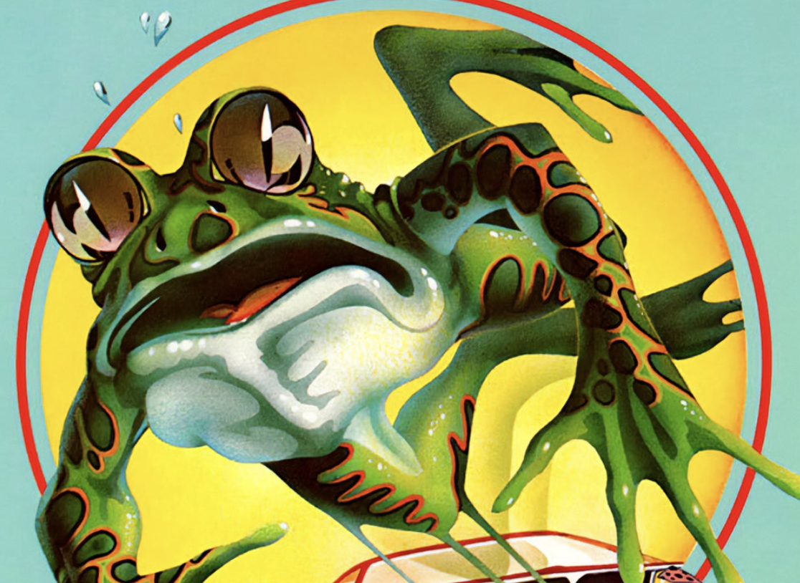
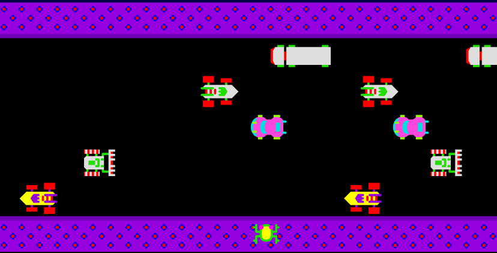

# Functional Specifications

## Table of Contents

Click to expand

- [Functional Specifications](#functional-specifications)
  - [Table of Contents](#table-of-contents)
  - [1. Introduction](#1-introduction)
    - [1.1 Overview](#11-overview)
    - [1.2 Purpose](#12-purpose)
    - [1.3 Out of Scope](#13-out-of-scope)
    - [1.4 Personas](#14-personas)
      - [Modern Gamer:](#modern-gamer)
      - [Old-school Gamer:](#old-school-gamer)
    - [1.5 Use cases](#15-use-cases)
  - [2. Frogger game](#2-frogger-game)
    - [2.1 Game Objective](#21-game-objective)
    - [2.2 Gameplay Mechanics](#22-gameplay-mechanics)
      - [2.2.1 Gameplay movement](#221-gameplay-movement)
      - [2.2.2 Gameplay controls](#222-gameplay-controls)
      - [2.2.3 Highway Crossing](#223-highway-crossing)
      - [2.2.4 River Crossing](#224-river-crossing)
      - [2.2.5 River Banks](#225-river-banks)
    - [2.3 Bonuses](#23-bonuses)
      - [2.3.1 Pink Frog](#231-pink-frog)
      - [2.3.2 Fly Bonus](#232-fly-bonus)
    - [2.4 Game Difficulty](#24-game-difficulty)
      - [Game Levels (1-8)](#game-levels-1-8)
    - [2.5 Time Band](#25-time-band)
    - [2.6 Scoring System](#26-scoring-system)
    - [2.7 End of Game](#27-end-of-game)
  - [3. Non-Functional Requirements](#3-non-functional-requirements)
    - [3.1 Costs](#31-costs)
        - [Capital Expenditures](#capital-expenditures)
        - [Time Invested](#time-invested)
        - [Operational Expenditures](#operational-expenditures)
        - [Project Scope](#project-scope)
    - [3.2 Response/Performance \& Reliability](#32-responseperformance--reliability)
        - [Performance Metrics](#performance-metrics)
        - [Failure modes](#failure-modes)
        - [Reliability Considerations](#reliability-considerations)
    - [3.3 Testability](#33-testability)
    - [3.4 Documentation](#34-documentation)
    - [3.5 Flexibility](#35-flexibility)
  - [4. Risks and Assumptions](#4-risks-and-assumptions)
    - [4.1 Risks](#41-risks)
    - [4.2 Copyright](#42-copyright)
    - [4.3 Budget considerations](#43-budget-considerations)
    - [4.4 External resources](#44-external-resources)
  - [Glossary](#glossary)

## 1. Introduction

This is the official document containing the functional specifications of the FPGA Frogger project. Our team is composed of:

| Name               | Role              | Description                                                                               |
| ------------------ | ----------------- | ----------------------------------------------------------------------------------------- |
| Max BERNARD        | Project Manager   | Responsible for project management, including timelines, planning, and team coordination. |
| David CUAHONTE     | Program Manager   | Manages functional specification development and client communication for the project.    |
| Aurélien FERNANDEZ | Technical Lead    | Guides technical decisions and translates requirements into scalable technical solutions. |
| Quentin CLEMENT    | Software Engineer | Develops and implements codebase, ensures code quality and collaboration within the team. |
| Mathis KAKAL       | Software Engineer | Develops and implements codebase, ensures code quality and collaboration within the team. |
| Antoine PREVOST    | Quality Assurance | Creates tests to validate the quality of the solution and to ensure compliance.           |
| Thibaud MARLIER    | Technical Writer  | Creates comprehensive end-user documentation to facilitate the usage of the application.  |

### 1.1 Overview

"Frogger FPGA" is a project aimed at creating a fun and interactive Frogger game using FPGA technology and Verilog programming language. In this classic arcade-style game, a player guides a frog across a busy road filled with moving cars and navigates a river with logs and other obstacles. The goal is to reach the other side while avoiding hazards safely. This project prioritizes an engaging gaming experience while also showcasing the power of FPGA for real-time applications.

_A logo of the game is shown below:_

### 1.2 Purpose

This project is an opportunity for us to dive deeper into Verilog programming and FPGA technology. Our main goal is to create a fun and exciting Frogger game that can be displayed on a 640x480 VGA monitor. The game involves a frog crossing a road filled with obstacles, focusing on delivering a smooth, engaging experience for users.

While the primary objective is to get the core gameplay functioning, we’re also considering adding more detailed graphics and possibly arcade features. However, adding sound falls outside the scope of this project.

### 1.3 Out of Scope

- <u>Arcade Cabinet:</u>
  An arcade cabinet would have a joystick and screen integrated into a casing to hide the entire system. The arcade would make the game easier to play and make the system less intimidating for non-technical people. However, such an endeavor would involve fabrication skills and resources beyond what is available to the team.

- <u>Sounds:</u>
  Sound effects and Music would add a sense of life to the game and make it closer to the original experience. The hardware available doesn't support sound. In addition, the benefits don't justify the effort of implementing a sound system from scratch.

- <u>Leaderboard:</u>
  A leaderboard would allow us to save and display the best score on the screen. This could make the game more attractive and more competitive. However, since these are not project objectives, this feature will not be implemented.

- <u>Multi-language support:</u>
  The game start button is "start" which means that the game isn't quite language agnostic. A multilingual solution would be a solution to remedy this issue. This solution is high effort and wasteful as it would require adding a language selection menu. Whereas simply making the game language agnostic could be done by changing the start button.

### 1.4 Personas

The primary users of the FPGA Frogger game include:

#### Modern Gamer:

**Gaming Habits:** Plays fast-paced competitive games (e.g., Rocket League, Apex Legends) and indie games with innovative mechanics.

**Motivations:**

- Innovation & Technology: Fascinated by unconventional game platforms like FPGA, appreciates creativity in game design, and wants to explore something that bridges classic gaming with modern tech.
- Challenge & Simplicity: Enjoys games that balance simplicity and complexity; likes to challenge their reflexes and strategy, but without unnecessary complexity in controls or story.
- Retro Appeal: Has a mild interest in retro aesthetics and finds the idea of FPGA recreating a classic arcade game intriguing, especially with a unique platform.

**Goals:**

- Explore New Technologies: Curious about how FPGA can be used in gaming, they want to experience how the performance and input speed of an FPGA-powered game compares to traditional platforms.
- Fun & Challenging Gameplay: They are seeking a game that challenges their reflexes but is still engaging and replayable without overly complex rules or mechanics.
- Quick & Casual Experience: Someone who enjoys competitive online games, they are looking for a game they can pick up quickly for short play sessions without a large time commitment.

**Frustrations:**

- Overly Complicated Games: Alex avoids games that are too convoluted, with multiple menus, levels of management, or excessive narrative.
- Lack of Polish: They dislike buggy games, have poor controls, or do not feel responsive—especially when trying a game on new technology like FPGA.
- Unintuitive Controls: Would quickly lose interest if the game’s controls are not intuitive or responsive to quick inputs.

**Preferred Features:**

- Responsive Controls: Values low input latency and high frame rates to make gameplay feel smooth and satisfying.
- Challenging Levels: Interested in increasing difficulty curves where skill is rewarded, like progressively harder levels or faster-moving objects.
- Visual Feedback: Prefers games with clear visual and audio feedback, especially in response to actions or mistakes (e.g., lives lost, jumps, hazards).
   

#### Old-school Gamer:

**Gaming Habits:** Grew up playing arcade games like Frogger, Pac-Man, and Space Invaders. Now enjoys replaying classics, either via emulators or retro-style games on consoles.

**Motivations:**

**Nostalgia:**

- Enjoys reliving the gaming experiences of their youth and values accuracy in recreating these moments.
- Simplicity: Prefers straightforward, easy-to-pick-up games where the objective is clear and the focus is on skill-based challenges.
- Curiosity for New Tech: While they prefer retro gameplay, they are curious about how new technologies (e.g., FPGA) can revive or improve these classic experiences without losing their authenticity.

**Goals:**

- Recreate the Arcade Experience: They want a game that captures the arcade experience, with accurate mechanics, graphics, and gameplay flow, but on new technology.
- Challenge themselves Again: They seek to experience the same gameplay challenge that they enjoyed as a teenager, testing their reflexes and memory.
- Teach the Next Generation: They hope to share their love for arcade games with their kids, introducing them to simpler yet rewarding gameplay without the overwhelming nature of modern titles.

**Frustrations:**

- Inauthentic Remakes: Dislikes when remakes or ports of retro games deviate too much from the original in terms of mechanics, visuals, or difficulty balance.
- Overcomplication: Prefers not to be overwhelmed with menus, tutorials, or complex modern features like microtransactions or customization that disrupt the core arcade experience.
- Technical Hiccups: They value the seamlessness of original arcade machines, so any bugs, crashes, or input delays would detract from their enjoyment of the FPGA game.

**Preferred Features:**

- Faithful Recreation: Sarah values mechanics that stay true to the original Frogger, including the exact placement of hazards, timing, and game difficulty.
- Simple, Physical Controls: Prefers simple control schemes similar to the arcade (e.g., a joystick or basic directional buttons), avoiding complex key mappings.
- Visual & Audio Accuracy: They appreciate retro pixel graphics, original sound effects, or music that captures the vibe of the classic Frogger, even if on new hardware.

### 1.5 Use cases

**Modern Gamer Explores FPGA Frogger**:

1. A modern gamer, curious about FPGA technology, connects the system to their VGA monitor and powers it on.
2. The gamer starts playing, moving the frog across the screen, and testing the game’s responsiveness with the FPGA hardware.
3. The gamer enjoys the retro-style gameplay while appreciating the modern tech behind it, and continues playing to see how far they can progress.

**Old-school Gamer Revisits a Classic Arcade Experience**:

1. An old-school gamer, familiar with the original Frogger, starts the FPGA version to see how it compares.
2. The gamer recognizes the gameplay mechanics and immediately feels nostalgic, guiding the frog across the screen while avoiding obstacles.
3. As the levels get harder, the gamer feels challenged by the faster obstacles but enjoys the faithful recreation of the original game on FPGA.

**Modern and Old-school Gamers Compete for High Scores**:

1. Both a modern and an old-school gamer set up the FPGA system for friendly competition.
2. They take turns playing, each trying to complete as many levels as possible without losing all their lives.
3. The gamers compare scores after each round, enjoying the blend of retro gameplay and the technical challenge presented by the FPGA platform.

## 2. Frogger game

### 2.1 Game Objective

To complete a level, the player must guide five frogs safely into the home bays. Each frog represents a life, and the player starts with four lives. The game ends when all frogs are lost or when the player completes all the levels. Additionally, Frogger has a time limit of 30 seconds (or 60 ticks) per frog, shown by a time band at the bottom of the screen. The remaining time also contributes to the player’s score if the frog reaches a home bay on time. This remains the same throughout all the levels.

_Frogger game:_

### 2.2 Gameplay Mechanics

#### 2.2.1 Gameplay movement

The frog advances one tile per button press. When the frog reaches the top row of the screen and completes the level, the frog is automatically repositioned at the bottom to begin the next level.

_Frog:_

#### 2.2.2 Gameplay controls

The player controls Frogger using the four buttons on the FPGA system. These buttons allow movement in four directions: up, down, left, and right.

_FPGA BUTTONS:_

#### 2.2.3 Highway Crossing

The player begins each round by moving the frog through a four-lane highway. Cars and trucks move horizontally across the screen in both directions at varying speeds. Traffic patterns vary in speed and direction, presenting a continuous challenge for the player to navigate without getting squashed. If the frog touches any vehicle, the player loses a life.

Each forward jump earns the player 10 points. Completing this section will lead the players to the next section.

_Highway:_

- **Key hazards:**
  - Vehicles: There are five different types of vehicles in the game, all equally deadly. If Frogger comes into contact with any of them, he will be crushed, resulting in the loss of a life.

| Name      | Picture                      | Size                          | Description                                                                                                                                    |
| --------- | ---------------------------- | ----------------------------- | ---------------------------------------------------------------------------------------------------------------------------------------------- |
| **Car 1** |    | **32x32** pixels   1 tile  | - **First hazard** encountered by the player   - Placed on **lane 2**   - Travels from **right to left**   - **Slowest** of all cars |
| **Car 2** |    | **32x32** pixels   1 tile  | - Placed on **lane 3**   - Travels from **left to right**                                                                                   |
| **Car 3** |    | **32x32** pixels   1 tile  | - Placed on **lane 4**   - Travels from **right to left**                                                                                   |
| **Car 4** |    | **32x32** pixels   1 tile  | - Placed on **lane 5**   - Travels from **left to right**   - The **fastest** car out of all                                             |
| **Truck** |  | **64x32** pixels   2 tiles | - Placed on **lane 6**   - Travels from **right to left**   - **Slowest** moving vehicle                                                 |

The speed of each of these vehicles increases with each level, as detailed further in the document in the section [Game Levels (1-8)](#game-levels-1-8).

#### 2.2.4 River Crossing

After crossing the highway, Frogger reaches the riverbank. To get to the home bays, the player must jump across floating logs, turtles, and other moving objects.
These logs vary in speed and direction, while turtles periodically dive underwater, requiring the player to hop off before they disappear.

Additional river hazards include snapping alligator jaws that can appear while Frogger is on logs. As the game progresses, new threats like fast-moving otters emerge, capable of pulling the frog into the water, increasing the challenge.

The river is divided into 7 rows:

- First row: The riverbank—a relatively safe area where the snake begins spawning after level 3.
- Second row: Contains sets of three turtles.
- Third row: Consists of short logs only.
- Fourth row: Consists of long logs only.
- Fifth row: Contains sets of two turtles.
- Sixth row: Consists of medium logs only.
- Seventh row: The goal, with five safe spots (home bays) that Frogger must fill. The grass here is unsafe, and enemies or bonuses may also appear.

_River Bank:_

**Logs**:

Logs come in three different sizes and shapes: short, medium, and long. Frogger can safely land on these logs without falling into the water, as they float from left to right across the screen.

Frogger can jump side to side while on a log, but the player has to be careful not to fall into the water. Additionally, Frogger can leap from one log to another floating object, moving forward or backward.

_Logs_:

  
  

**Small logs:**

A small log spans the equivalent of 2 tiles.
Thus 64x32 pixels.

**Medium logs:**

A medium log spans the equivalent of 3 tiles.
Thus 96x32 pixels.

**Long Logs:**

A long log spans the equivalent of 5 tiles.
Thus 160x32 pixels.

**Key hazards**:

- **Diving Turtles**: Turtles in the game appear in sets of two or three. You can jump on them when they are above the water, where they function like logs, supporting the frog. However, the player needs to be wary of the turtles that dive underwater. If Frogger is still on a turtle when it dives, he will fall into the water and lose a life. To avoid this, players must leap to another floating object before the turtles submerge. Additionally, if you jump to the left or right off the edge of a turtle group, Frogger will also fall into the water, leading to the loss of a life.

_Diving Turtles:_

- **Alligator Jaws**: Beware of logs with hidden alligator jaws. They are alligators disguised as logs. The thing that differentiates them from the logs is their jaws. You can jump on the alligator's back safely, but if Frogger jumps into the alligator's open jaw, the user loses a life. Every second, the alligator clacks its jaw, when the jaws are closed, Frogger can walk on the alligator's head.

_Alligator:_

- **Otters**: These creatures swim rapidly and can snatch Frogger off floating objects, adding an extra layer of challenge for the player. They only start appearing after level 3. Every second, they perform a brief swimming animation, signaling their presence and keeping players on their toes.

_Otters:_

If Frogger falls into the river, the player loses a life, as the frog cannot swim.

#### 2.2.5 River Banks

At the top of the screen, there are five home bays that Frogger must safely reach to complete a level. However, some bays may occasionally be blocked by hazards, such as alligator heads. If a bay is blocked, the player must wait or aim for a different one. Once Frogger successfully reaches a home bay, that bay becomes unavailable for the rest of the level, and the player must fill the remaining bays to advance.

Reaching a home bay grants **50 points**, and players can earn bonus points if a fly or pink frog appears, as explained in the next section. The player must navigate all five frogs to the home bays to complete a level.

_River banks:_

- **Filling the home bay:**
  - When the player reaches a home bay, a frog is placed inside it. Once filled, the player cannot enter that home bay again. If the player attempts to jump into a home bay that has already been filled, Frogger will lose a life.

On the upper river bank, one enemy can spawn:

- **Alligator's head**: If an alligator's head is showing in a home bay, it is not safe to enter it. Jumping into it will result in the death of a frog. However, if the alligator just appeared, there's a 2-second safe period before being deadly.

_Alligator's head:_

On the lower river bank and the logs, one more enemy can spawn after level 3:

- **Snakes**: They are deadly enemies spawning randomly on the logs and the lower river bank. It goes from left to right. If a snake touches the frog, it will lead to the death of the frog. The snake has a moving animation, as shown below, that changes every clock cycle.

_Snake:_

### 2.3 Bonuses

In "Frogger," players can increase their score through special bonuses scattered throughout the game. The key bonuses are as follows:

#### 2.3.1 Pink Frog

- Occasionally, a pink "lady" frog appears on a log within the river.
- The pink frog moves from left to right on the log she's on.
- To earn bonus points, players must jump onto the log with the pink frog and safely guide her to a home bay.
- Successfully bringing the pink frog home grants the player **200 bonus points**.

_Pink frog:_

#### 2.3.2 Fly Bonus

- A fly may appear in one of the home bays at random intervals.
- Players can earn additional points by hopping Frogger into the home bay with the fly.
- Collecting the fly rewards the player with **200 bonus points**.

_Flies:_

  

### 2.4 Game Difficulty

The difficulty in "Frogger" escalates across four distinct levels. Here’s a breakdown of what to expect at each level:

#### Game Levels (1-8)

- **Level 1**:

  - At the start, Frogger can float off-screen for a frame, allowing for a moderate introduction to the gameplay.
  - Traffic patterns are manageable, with vehicles moving across the screen with periodically larger gaps. Players will have time to learn the timing of their movements without the pressure of fast-moving obstacles.
  - River obstacles, such as logs and turtles, are plentiful, and the players will have ample opportunities to practice hopping safely across the water.
  - As players progress through these levels, the speed of traffic and river objects gradually increases.

- **Level 2**:

  - Alligators start to appear in the river alongside the logs.
  - The frog can walk on the alligator's back but Frogger will die if it walks on the alligator's head.

- **Level 3 & 4**:
  - In these advanced levels, Frogger can no longer float off-screen.
  - The game starts at a higher difficulty, with traffic being denser and logs more sparse.
  - New hazards are introduced, such as **otter attacks** that can push frogger into the water.
  - With fewer floating objects in the river, players must navigate a more treacherous environment.
- **Level 5 to 8**
  - After these levels, the speed increases sharply.
  - The density of traffic is lower but will increase again.

To proceed to the next level, the player must safely guide five frogs into the home bays. After completing all levels, the difficulty ramps up again.

<!-- reference video https://www.youtube.com/watch?v=k3nKtOh41fE -->

- **Speed of objects in second to cross the screen**:

| Level | Lane1 | Lane2 | Lane3 | Lane4 | Lane5 | Turtle1 | Log1 | Log2 | Turtle2 | Log3 | Snakes |
| ----- | ----- | ----- | ----- | ----- | ----- | ------- | ---- | ---- | ------- | ---- | ------ |
| 1     | 22    | 18    | 15    | 10    | 8     | 8       | 22   | 4    | 8       | 11   | /      |
| 2     | 22    | 18    | 15    | 10    | 8     | 8       | 22   | 4    | 8       | 11   | /      |
| 3     | 22    | 18    | 15    | 10    | 8     | 8       | 22   | 4    | 8       | 11   | 8      |
| 4     | 20    | 18    | 15    | 10    | 8     | 8       | 20   | 4    | 8       | 10   | 8      |
| 5+    | 8     | 12    | 8     | 2     | 10    | 4       | 20   | 8    | 12      | 8    | 8      |

Alligators have the same speed as the logs in the lane they are in.
Otters are 10% faster than the logs or turtles in the lane.

- **Density of cars and logs:**

| Level   | Lane 1                                                                            | Lane 2                                                                                                                 | Lane 3                                                                            | Lane 4                               | Lane 5                               | Banking     | Water 1                                                                                                             | Water 2                                                                                     | Water 3                                   | Water 4                                                                                | Water 5                                                                      | Home |
| ------- | --------------------------------------------------------------------------------- | ---------------------------------------------------------------------------------------------------------------------- | --------------------------------------------------------------------------------- | ------------------------------------ | ------------------------------------ | ----------- | ------------------------------------------------------------------------------------------------------------------- | ------------------------------------------------------------------------------------------- | ----------------------------------------- | -------------------------------------------------------------------------------------- | ---------------------------------------------------------------------------- | ---- |
| Level 1 | **3 cars**, spaced by **4 tiles**                                                 | **3 cars**, spaced by **3 tiles**                                                                                      | **3 cars**, spaced by **3 tiles**                                                 | **1 car**                            | **2 cars**, spaced by **4 tiles**    | X           | **4 sets** of **3 turtles**, **1 tile apart**, first set is **diving turtles**                                      | **3 small logs**, **2 tiles apart**                                                         | **3 long logs**, **2 tiles apart**        | **4 sets** of **2 turtles**, **2 tiles apart**, first set is **diving turtles**        | **3 medium logs**, **2 tiles apart**                                         | X    |
| Level 2 | **4 cars**, first **3** separated by **4 tiles**, fourth separated by **2 tiles** | **4 cars**, separated by **4 tiles**                                                                                   | **4 cars**, first **3** separated by **4 tiles**, fourth separated by **2 tiles** | **2 cars**, separated by **2 tiles** | **3 cars**, separated by **4 tiles** | X           | **3 sets** of **3 turtles**, first set separated by **3 tiles**, second and third by **1 tile**                     | **3 small logs**, **2 tiles apart**                                                         | **1 long log**                            | **5 sets** of **2 turtles**, **1 tile apart**, first set is **diving turtles**         | **3 logs**, **2 tiles apart**, **1 crocodile** replaces a log every interval | X    |
| Level 3 | **4 cars**, separated by **3 tiles**                                              | **4 cars**, first **3** separated by **4 tiles**, last separated by **2 tiles**                                        | **5 cars**, first **4** separated by **3 tiles**, last separated by **1 tile**    | **2 cars**, separated by **3 tiles** | **3 cars**, separated by **2 tiles** | **1 snake** | **3 sets** of **3 turtles**, **2 tiles apart**, **1/3** are **diving turtles**                                      | **3 small logs**, first separated by **3 tiles**, last two by **1 tile**                    | **1 long log**                            | **4 sets** of **2 turtles**, **2 tiles apart**, **1/4** are **diving turtles**         | **2 medium logs**, **2 tiles apart**                                         | X    |
| Level 4 | **4 cars**, first **3** separated by **3 tiles**, last separated by **1 tile**    | **4 cars**, separated by **3 tiles**                                                                                   | **4 cars**, first **3** separated by **3 tiles**, last separated by **1 tile**    | **3 cars**, separated by **3 tiles** | **4 cars**, separated by **2 tiles** | **1 snake** | **3 sets** of **3 turtles**, separated by **3 tiles**, **1/3** are **diving turtles**                               | **2 small logs**, separated by **4 tiles**                                                  | **1 long log**                            | **3 sets** of **2 turtles**, separated by **2 tiles**, **1/3** are **diving turtles**  | **2 medium logs**, separated by **2 tiles**                                  | X    |
| Level 5 | **5 cars**, first **4** separated by **2 tiles**, fifth separated by **1 tile**   | **4 cars**, separated by **3 tiles**                                                                                   | **5 cars**, separated by **2 tiles**                                              | **4 cars**, separated by **2 tiles** | **3 cars**, separated by **2 tiles** | **1 snake** | **2 sets** of **3 turtles**, separated by **3 tiles**, **1/2** are **diving turtles**                               | **2 small logs**, separated by **3 tiles**                                                  | **1 long log**                            | **3 sets** of **2 turtles**, separated by **3 tiles**                                  | **1 crocodile**                                                              | X    |
| Level 6 | **3 cars**, separated by **3 tiles**                                              | **3 cars**, separated by **3 tiles**                                                                                   | **3 cars**, separated by **3 tiles**                                              | **1 car**                            | **2 cars**, separated by **3 tiles** | **1 snake** | **4 sets** of **3 turtles**, separated by **2 tiles**, **1/4** are **diving turtles**                               | **3 small logs**, separated by **2 tiles**                                                  | **2 long logs**, separated by **2 tiles** | **4 sets** of **2 turtles**, separated by **2 tiles**, **1/4** are **diving turtles**  | **2 medium logs**, **1 crocodile**, separated by **2 tiles**                 | X    |
| Level 7 | **4 cars**, first **3** separated by **3 tiles**, last separated by **1 tile**    | **4 cars**, separated by **3 tiles**                                                                                   | **4 cars**, first **3** separated by **3 tiles**, last separated by **1 tile**    | **2 cars**, separated by **1 tile**  | **3 cars**, separated by **3 tiles** | **1 snake** | **3 sets** of **3 turtles**, first separated by **3 tiles**, last two by **1 tile**, last set is **diving turtles** | **3 small logs**, separated by **3 tiles**                                                  | **1 long log**                            | **5 sets** of **2 turtles**, separated by **1 tile**, **1/5** are **diving turtles**   | **1 crocodile**, **2 medium logs**, separated by **2 tiles**                 | X    |
| Level 8 | **4 cars**, separated by **3 tiles**                                              | **4 cars**, first and second separated by **3 tiles**, second and third by **1 tile**, third and fourth by **3 tiles** | **5 cars**, first and second separated by **1 tile**, others by **2 tiles**       | **2 cars**, separated by **3 tiles** | **3 cars**, separated by **2 tiles** | **1 snake** | **3 sets** of **3 turtles**, separated by **2 tiles**, first set is **diving turtles**                              | **3 small logs**, first and second separated by **1 tile**, second and third by **3 tiles** | **1 long log**                            | **4 sets** of **2 turtles**, separated by **2 tiles**, first set is **diving turtles** | **1 medium log**, **1 crocodile**, separated by **2 tiles**                  | X    |

### 2.5 Time Band

Frogger has a time limit of 30 seconds (or 60 ticks) to reach the home bay.
If the player fails to bring the frog to the home bay within this time, they will lose a life.
The remaining time is displayed as a time band at the bottom right of the screen.

_Time band_:

The time band gradually shrinks as time passes. When only 10 seconds (or 20 ticks) remain, the time band turns red to signal that time is running out, as shown below:

_Time running out_:

### 2.6 Scoring System

Points are awarded for various actions within the game:

| Action              | Points Earned                 |
| ------------------- | ----------------------------- |
| Jump Forward        | +10 points                    |
| Reaching Home Bay   | +50 points                    |
| Beating A Level     | +1,000 points                 |
| Escorting Pink Lady | +200 points                   |
| Eating A Fly        | +200 points                   |
| Bonus Time          | +10 points \* ticks remaining |
| Score = 20,000      | 1 life gained                 |

If the player reaches a high score of 20,000 points and fewer than four frogs remain, an extra frog (life) is awarded.

### 2.7 End of Game

The game ends when all of Frogger's lives are lost. At this point, the player can either restart the game or reset it using the FPGA system to begin a new round. Additionally, if the player successfully reaches the end of the 8th level, they will have beaten the game. They will then be redirected to the main menu.

## 3. Non-Functional Requirements

This section outlines the non-functional requirements for the FPGA Frogger game project, focusing on costs, performance, reliability, and testability.

### 3.1 Costs

##### Capital Expenditures

- **Board**: NandLand Go-Board, priced at $70 including VAT.
- **Monitor**: Acer EK251Q EBI, priced at $124.99 VAT.

The capital expenditures, including the board and monitor, are furnished by the school. There are no relevant development environment costs, as the project uses freely available software.

##### Time Invested

Since this is an educational project, significant time will be invested in learning Verilog and FPGA design. The goal is to both create a functional product and gain knowledge of the tools and hardware.

##### Operational Expenditures

As the project is entirely self-contained, running on the FPGA hardware, there are no cloud services, server usage, or ongoing maintenance costs. Operational expenditures are expected to be at a minimum after development.

##### Project Scope

The scope of this project is focused on learning FPGA and Verilog programming while building a fun, playable Frogger game. The cost needs to stay low as the primary objective is education.

### 3.2 Response/Performance & Reliability

This section defines how quickly and reliably the system responds to user inputs and renders changes on the screen.

##### Performance Metrics

- **VGA Display**: The game runs at a 640x480 resolution, there will be smooth transitions between game objects while adhering to VGA timing constraints. Clear visuals and a consistent refresh rate are expected.
- **Target FPS**: The game aims for a frame rate of 30 FPS without screen tearing.
- **Input Latency**: The frog’s movement should occur within 10 to 30 milliseconds of pressing a button.
- **Object Movement**: Vehicles and obstacles must move fluidly across the screen without jittering. Object speeds will vary by difficulty, but all movements should be smooth and reliable.

##### Failure modes

- If all four buttons are pressed at once the game restarts.
- If two or more inputs are made at the same time the output is combined. Eg. Left and Up would be diagonal.

##### Reliability Considerations

- **Error Handling**: The system needs to handle unexpected conditions, such as edge cases like simultaneous button presses. The game will reset or retry if these occur.
- **Stability**: The game should not crash or freeze during normal gameplay, the players need to be able to complete the game without technical issues.

### 3.3 Testability

Testability refers to how easily the system's functionality can be verified.

A comprehensive test plan is being developed by a team member. The testing process will cover both simulation and in-hardware testing, with manual gameplay serving as the primary method due to the project's hardware setup.

### 3.4 Documentation

- **Definition:** The quality and comprehensiveness of documentation provided to aid in learning, future reference, and ensuring that the project’s goals, scope, and ambitions are clearly communicated. The documentation must align with our vision for the software.

- **Considerations:**

  - **Comprehensive Documentation:** Our team will ensure that all of the documentation of the project is comprehensive for everyone by having clear English.
  - **Code Documentation:** Code should be easily readable and commented with purpose. Ensuring comprehensiveness and clarity in the software. As Verilog is a low-level language, clarity will be necessary.

### 3.5 Flexibility

- **Definition:** Flexibility refers to the system's ability to accommodate future enhancements, evolving user needs, and minor adjustments without requiring major rework.

  In this project, flexibility ensures that the game remains reprogrammable over time, allowing for potential feature additions such as new levels, difficulty settings, or user-requested improvements.

- **Considerations:**
  - **Feature Extensions:** Although our team won't provide post-project support, the game’s design must allow future developers to easily modify and extend its functionalities.
  - **Bug Fixes:** A flexible system also simplifies the process of addressing bugs, as developers will not struggle to efficiently implement fixes without needing to overhaul the software structure.

## 4. Risks and Assumptions

### 4.1 Risks

| **Risk**                 | **Impact** | **Mitigation**                                                                                                                                                      |
| ------------------------ | ---------- | ------------------------------------------------------------------------------------------------------------------------------------------------------------------- |
| **Hardware Failure**     | High       | Regular testing of hardware components and keeping backup components available to minimize downtime.                                                                |
| **Software Development** | Medium     | As Verilog is not designed for game development, thorough planning, and incremental testing will help manage issues, along with continued learning of the language. |

### 4.2 Copyright

Frogger is owned by Konami, meaning we are not permitted to use the same code, assets, or trademarked elements from the original game. However, gameplay mechanics themselves are not protected by copyright, and can only be patented, which is rare in the case of gameplay.
Since we are creating our own software and using assets that are inspired by, but not copied from, the original Frogger game, there are no legal issues related to the development of this project. The name “Frogger” and any specific trademarks related to it will not be used in our project.

### 4.3 Budget considerations

As the game is being created from scratch, there should not be any expenses related to the software creation. However, there may be a need to spend some money on unforeseen components or enhancements. It’s important to note that while the FPGA board and VGA monitor were provided by the school, future users of the project will need to obtain these components themselves. We reserve the right to recommend specific functionalities if deemed necessary.

### 4.4 External resources

To enhance our understanding of the game mechanics, we referred to the official Frogger manual. [Link](https://annarchive.com/files2/Frogger%20%28U%29.pdf)

## Glossary

| Word                                 | Definition                                                                                                                                                                                                                                 |
| ------------------------------------ | ------------------------------------------------------------------------------------------------------------------------------------------------------------------------------------------------------------------------------------------ |
| FPGA (Field-Programmable Gate Array) | A type of hardware that can be programmed after manufacturing to perform different tasks. In this project, it is used to create the Frogger game.                                                                                          |
| Verilog                              | A hardware description language (HDL) used to design and model electronic systems. It is used to program the FPGA for this project.                                                                                                        |
| VGA (Video Graphics Array)           | A display standard that provides the graphical interface for the game. In this project, the game is displayed at 640x480 resolution using VGA output.                                                                                      |
| Tiles                                | The basic unit of measurement for movement in the game. The frog moves one tile at a time.                                                                                                                                                 |
| Ticks                                | A unit of time used in the game, where one tick equals 0.5 seconds. The player has 60 ticks (30 seconds) to complete certain actions.                                                                                                      |
| Objects                              | Vehicles, logs, turtles, and other elements that move across the screen, pose a hazard or platform for Frogger.                                                                                                                            |
| Capital Expenditures                 | The fixed costs associated with hardware like the FPGA board and VGA monitor.                                                                                                                                                              |
| Input Latency                        | The delay between pressing a control button and the movement of Frogger on the screen. It should be between 10 and 30 milliseconds.                                                                                                        |
| Performance Metrics                  | A set of targets ensuring the game runs smoothly, including a frame rate of 30 FPS, smooth object movement, and a 640x480 display.                                                                                                         |
| Non-Functional Requirements          | Aspects of the project that are not directly related to the gameplay but impact the overall performance, reliability, and ease of future modifications.                                                                                    |
| Simulation Testing                   | A method used to test the game’s functionality before deploying it on actual hardware. This is done using software simulations.                                                                                                            |
| Error Handling                       | Mechanisms put in place to manage unexpected conditions in the game, such as pressing multiple buttons simultaneously.                                                                                                                     |
| Frame Rate                           | The speed at which the game renders frames on the screen, targeted at 30 frames per second (FPS).                                                                                                                                          |
| Konami                               | A Japanese video game company known for creating and publishing popular titles. They hold the rights to the Frogger franchise, including its name, assets, and original code. |
