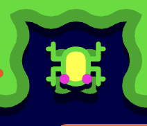

# Test Cases

## Overview

This document outlines the different critical points of the software which will be tested. Those tests will ensure the device can be used in production by anyone without significant bug.

## Criticality

The test cases are defined by a criticality level, indicating the importance of the feature in the system and the inner workings of the device.

| Color | Priority |
| ----- | -------- |
| 🔴     | High     |
| 🟡     | Medium   |
| 🟢     | Low      |
 
### 1. The code can be built

| ID               | 1                                                |
| ---------------- | ------------------------------------------------ |
| Name             | The code can be built                            |
| Test Description | Running `apio build` should not return any error |
| Test Type        | Manual                                           |
| Test Criticality | 🔴                                                |
| Expected Result  | The code should compile without any errors.      |

**Hardware:**

- Go Board

**Steps:**

1. Run the command `apio build` in the src folder of the project.

**Expected Result:**

---
 
### 2. The game can be uploaded on the Go Board FPGA

| ID               | 2                                                                     |
| ---------------- | --------------------------------------------------------------------- |
| Name             | The game can be uploaded on the Go Board FPGA                         |
| Test Description | Running apio upload should complete without any errors.               |
| Test Type        | Manual                                                                |
| Test Criticality | 🔴                                                                     |
| Expected Result  | No errors should occur, and the process should complete successfully. |

**Hardware:**

- Go Board

**Steps:**

1. Run the command `apio upload` in the src folder of the project.

**Expected Result:**

---
 
### 3. Move Frogger up

| ID               | 3                                                             |
| ---------------- | ------------------------------------------------------------- |
| Name             | Move Frogger up                                               |
| Test Description | Pressing Switch 1 should move the frog one tile up.           |
| Test Type        | Manual                                                        |
| Test Criticality | 🔴                                                             |
| Expected Result  | The frog should move one tile up (1/15 of the screen height). |

**Hardware:**

- Go Board

**Steps:**

1. Press the Switch 1 button.

---
 
### 4. Move Frogger down

| ID               | 4                                                               |
| ---------------- | --------------------------------------------------------------- |
| Name             | Move Frogger down                                               |
| Test Description | Pressing Switch 4 should move the frog one tile down.           |
| Test Type        | Manual                                                          |
| Test Criticality | 🔴                                                               |
| Expected Result  | The frog should move one tile down (1/15 of the screen height). |

**Hardware:**

- Go Board

**Steps:**

1. Press the Switch 4 button.

---
 
### 5. Move Frogger left

| ID               | 5                                                              |
| ---------------- | -------------------------------------------------------------- |
| Name             | Move Frogger left                                              |
| Test Description | Pressing Switch 2 should move the frog one tile left.          |
| Test Type        | Manual                                                         |
| Test Criticality | 🔴                                                              |
| Expected Result  | The frog should move one tile left (1/20 of the screen width). |

**Hardware:**

- Go Board

**Steps:**

1. Press the Switch 2 button.

---
 
### 6. Move Frogger right

| ID               | 6                                                               |
| ---------------- | --------------------------------------------------------------- |
| Name             | Move Frogger right                                              |
| Test Description | Pressing Switch 3 should move the frog one tile up.             |
| Test Type        | Manual                                                          |
| Test Criticality | 🔴                                                               |
| Expected Result  | The frog should move one tile right (1/20 of the screen width). |

**Hardware:**

- Go Board

**Steps:**

1. Press the Switch 3 button.

---
 
### 7. Single tile movement per button press

| ID               | 7                                                                                                                                                        |
| ---------------- | -------------------------------------------------------------------------------------------------------------------------------------------------------- |
| Name             | Single tile movement per button press                                                                                                                    |
| Test Description | When pressing a button, the frog should move only one tile in the corresponding direction. This behavior should occur even when the button is held down. |
| Test Type        | Manual                                                                                                                                                   |
| Test Criticality | 🔴                                                                                                                                                        |
| Expected Result  | The frog should move exactly one tile in the pressed direction, even if the button is held down.                                                         |

**Hardware:**

- Go Board

**Steps:**

1. Press and hold the Switch 1 button.
2. Ensure that the frog moves only one tile up.
3. Press and hold the Switch 4 button.
4. Ensure that the frog moves only one tile down.
5. Press and hold the Switch 2 button.
6. Ensure that the frog moves only one tile left.
7. Press and hold the Switch 3 button.
8. Ensure that the frog moves only one tile right.

---
 
### 8. Frogger loses a life when colliding with a car

| ID               | 8                                                               |
| ---------------- | --------------------------------------------------------------- |
| Name             | Frogger loses a life when colliding with a car                  |
| Test Description | When the frog collides with a car, the frog should lose a life. |
| Test Type        | Manual                                                          |
| Test Criticality | 🔴                                                               |
| Expected Result  | One fewer LED should be lit on the board.                       |

**Hardware:**

- Go Board

**Steps:**

1. Move the frog on the first road lane.
2. Wait for a car to collide with the frog.

---
 
### 9. Frogger loses a life when entering the water

| ID               | 9                                                      |
| ---------------- | ------------------------------------------------------ |
| Name             | Frogger loses a life when entering the water           |
| Test Description | When the frog enters the water, it should lose a life. |
| Test Type        | Manual                                                 |
| Test Criticality | 🔴                                                      |
| Expected Result  | One fewer LED should be lit on the board.              |

**Hardware:**

- Go Board

**Steps:**

1. Reach the lower river bank after the road.
2. Ensure no log is coming on the first river lane and move up.

---
 
### 10. Presence of 5 home bases

| ID               | 10                                                               |
| ---------------- | ---------------------------------------------------------------- |
| Name             | Presence of 5 home bases                                         |
| Test Description | There should be 5 home bases displayed on the screen.            |
| Test Type        | Manual                                                           |
| Test Criticality | 🔴                                                                |
| Expected Result  | There should be 5 home bases displayed on the top of the screen. |

**Hardware:**

- Go Board

**Steps:**

1. Check the top of the screen.

---
 
### 11. Fluid movement of objects across the screen

| ID               | 11                                                                                          |
| ---------------- | ------------------------------------------------------------------------------------------- |
| Name             | Fluid movement of objects across the screen                                                 |
| Test Description | The movement of cars and logs should be fluid, without choppiness.                          |
| Test Type        | Manual                                                                                      |
| Test Criticality | 🔴                                                                                           |
| Expected Result  | All elements on the screen should move smoothly, with a stable framerate of at least 30fps. |

**Hardware:**

- Go Board

**Steps:**

1. Check the movement of the cars, logs and bonuses to ensure they move fluidly for 30 seconds.
2. Observe Frogger's movement to ensure it is fluid.
3. Check for any screen tearing or flickering.
4. Verify that the framerate remains stable.

---
 
### 12. The textures of the elements are correct.

| ID               | 12                                                                                       |
| ---------------- | ---------------------------------------------------------------------------------------- |
| Name             | The textures of the elements are correct.                                                |
| Test Description | Verify that the sprites of the cars, logs, frog, and bonuses match the expected designs. |
| Test Type        | Manual                                                                                   |
| Test Criticality | 🔴                                                                                        |
| Expected Result  | The textures should match the expected ones.                                             |

**Hardware:**

- Go Board

**Steps:**

1. Ensure Frogger's texture matches the expected sprite.
2. Ensure the cars' textures match the expected sprites.
3. Ensure the logs' textures match the expected sprites.
4. Ensure the bonuses' textures match the expected sprites.
5. Ensure the home bases' textures match the expected sprites.
6. Ensure the water's textures match the expected sprites.
7. Ensure the road's textures match the expected sprites.
8. Ensure the safe zones' textures match the expected sprites.

**Comparison Table:**

| Name of the texture     | Texture                                                   |
| ----------------------- | --------------------------------------------------------- |
| Frog                    | 

           |
| Home Bay                | 

            |
| Road                    | 

           |
| River                   | 

         |
| Log Start               | 

  |
| Log Middle              | 

    |
| Log End                 | 

    |
| Car Lane 1              | 

           |
| Car Lane 2              | 

           |
| Car Lane 3              | 

           |
| Car Lane 4              | 

           |
| Truck Lane 5            | 

         |
| Turtle / Diving Turtles | 

      |
| Home Bay Grass          | 

   |
| Pink Lady               | 

 |
| Fly                     | 

             |

---
 
### 13. Lanes contain various elements

| ID               | 13                                                                          |
| ---------------- | --------------------------------------------------------------------------- |
| Name             | Lanes contain various elements                                              |
| Test Description | The lanes should contain various elements such as cars, logs, bonuses, etc. |
| Test Type        | Manual                                                                      |
| Test Criticality | 🔴                                                                           |
| Expected Result  | Each lane should contain the elements indicated in the table.               |

**Hardware:**

- Go Board

**Steps:**

1. Verify content of the lanes matches the elements indicated in the linked table.

**Comparison Table:**

| Lane number (from bottom to top) | Element texture                                                                                         | Additional comments                                  |
| -------------------------------- | ------------------------------------------------------------------------------------------------------- | ---------------------------------------------------- |
| 1                                |                                                                               |                                                      |
| 2                                |                                                                               |                                                      |
| 3                                |                                                                               |                                                      |
| 4                                |                                                                               |                                                      |
| 5                                |                                                                             |                                                      |
| 7                                |                                                                          | Groups of 3 turtles separated by 1-tile empty spaces |
| 8                                |    | 3-tile long logs separated by a 4-tile empty space   |
| 9                                |    | 7-tile long logs separated by a 2-tile empty space   |
| 10                               |                                                                          | Groups of 2 turtles separated by 2-tile empty spaces |
| 11                               |    | 4-tile long logs separated by a 2-tile empty space   |

---
 
### 14. Frogger body display in home base during same level

| ID               | 14                                                                                                                    |
| ---------------- | --------------------------------------------------------------------------------------------------------------------- |
| Name             | Frogger body display in home base during same level                                                                   |
| Test Description | When the frog has reached a home base, its body should be displayed in the home base until the next level starts.     |
| Test Type        | Manual                                                                                                                |
| Test Criticality | 🟡                                                                                                                     |
| Expected Result  | The bodies of the frog should be displayed in the home bases until all the bases were reached and a new level starts. |

**Hardware:**

- Go Board

**Steps:**

1. Reach a home base.
2. Verify the frog's body is displayed in the home base.
3. Repeat steps 1 and 2 for each home base.

**Expected result:**

---
 
### 15. Moving Animations

| ID               | 15                                                                         |
| ---------------- | -------------------------------------------------------------------------- |
| Name             | Moving Animations                                                          |
| Test Description | The snakes and otters should have moving animations.                       |
| Test Type        | Manual                                                                     |
| Test Criticality | 🟡                                                                          |
| Expected Result  | The snakes and otters should have moving animations with various textures. |

**Hardware:**

- Go Board

**Steps:**

1. Verify the snakes and otters have moving animations.

---
 
### 16. Objects are moving at the indicated speed

| ID               | 16                                                                              |
| ---------------- | ------------------------------------------------------------------------------- |
| Name             | Objects are moving at the indicated speed                                       |
| Test Description | Objects are moving at a pre-defined speed depening on the level and their lane. |
| Test Type        | Manual                                                                          |
| Test Criticality | 🟡                                                                               |
| Expected Result  | The objects should move at their expected speed.                                |

**Hardware:**

- Go Board

**Steps:**

1. Verify the speed of the cars, logs, bonuses, etc. matches the expected speed indicated in the linked table.

---
 
### 17. Limited time to cross the screen

| ID               | 17                                                                                                     |
| ---------------- | ------------------------------------------------------------------------------------------------------ |
| Name             | Limited time to cross the screen                                                                       |
| Test Description | Frogger should have 30 seconds to reach the home base at the top of the screen.                        |
| Test Type        | Manual                                                                                                 |
| Test Criticality | 🟡                                                                                                      |
| Expected Result  | One fewer LED should be litted up if time runs out and Frogger should be teleported back to the spawn. |

**Hardware:**

- Go Board

**Steps:**

1. Wait 30 seconds without moving the frog

---
 
### 18. Time Indicator Presence

| ID               | 18                                                        |
| ---------------- | --------------------------------------------------------- |
| Name             | Time Indicator Presence                                   |
| Test Description | There should be a time indicator displayed on the screen. |
| Test Type        | Manual                                                    |
| Test Criticality | 🟢                                                         |
| Expected Result  | There should be a time indicator displayed on the screen. |

**Hardware:**

- Go Board

**Steps:**

1. Check the presence of a time indicator on the screen like the one attached.

**Expected Result:**

---
 
### 19. Time Indicator Alternative Display

| ID               | 19                                                                                       |
| ---------------- | ---------------------------------------------------------------------------------------- |
| Name             | Time Indicator Alternative Display                                                       |
| Test Description | When 10 seconds remain, the time indicator should change its display.                    |
| Test Type        | Manual                                                                                   |
| Test Criticality | 🟢                                                                                        |
| Expected Result  | The time indicator should change its display, switching to red when 10 seconds are left. |

**Hardware:**

- Go Board

**Steps:**

1. Check the presence of a time indicator on the screen like the one attached.
2. Wait until only 10 seconds remain, which should correspond to 1/3 of the time indicator.

**Expected Result:**

---
 
### 20. Score Incrementation

| ID               | 20                                                                               |
| ---------------- | -------------------------------------------------------------------------------- |
| Name             | Score Incrementation                                                             |
| Test Description | When reaching an empty home base, the score should be incremented by 100 points. |
| Test Type        | Manual                                                                           |
| Test Criticality | 🔴                                                                                |
| Expected Result  | The score should have been incremented by 100 points.                            |

**Hardware:**

- Go Board

**Steps:**

1. Reach an empty home base.

---
 
### 21. Filled Home Base - Warping

| ID               | 21                                                                               |
| ---------------- | -------------------------------------------------------------------------------- |
| Name             | Filled Home Base - Warping                                                       |
| Test Description | When filling a home base, the frog should be warped to the bottom of the screen. |
| Test Type        | Manual                                                                           |
| Test Criticality | 🔴                                                                                |
| Expected Result  | A sprite of the frog should be warped to the bottom of the screen.               |

**Hardware:**

- Go Board

**Steps:**

1. Reach an empty home base.

---
 
### 22. Level incrementation

| ID               | 22                                                                                                  |
| ---------------- | --------------------------------------------------------------------------------------------------- |
| Name             | Level incrementation                                                                                |
| Test Description | When all home bases are filled, the level should be incremented by 1.                               |
| Test Type        | Manual                                                                                              |
| Test Criticality | 🔴                                                                                                   |
| Expected Result  | The home bases should be emptied and the level should be incremented by 1 on the 7-segment display. |

**Hardware:**

- Go Board

**Steps:**

1. Fill all the home bases.

---
 
### 23. Game resets after losing all lives

| ID               | 23                                                                                                                    |
| ---------------- | --------------------------------------------------------------------------------------------------------------------- |
| Name             | Game resets after losing all lives                                                                                    |
| Test Description | When no more LEDs are litted, the game should reset to the first level with 3 lives.                                  |
| Test Type        | Manual                                                                                                                |
| Test Criticality | 🔴                                                                                                                     |
| Expected Result  | The home bases should be emptied, the 7-segment display should show the number 1 and the 3 lives LEDs should be light |

**Hardware:**

- Go Board

**Steps:**

1. Lose all lives.

---
 
### 24. Win Condition

| ID               | 24                                                         |
| ---------------- | ---------------------------------------------------------- |
| Name             | Win Condition                                              |
| Test Description | The player should win the game upon beating the 8th level. |
| Test Type        | Manual                                                     |
| Test Criticality | 🔴                                                          |
| Expected Result  | The game’s state machine should switch to the 'WIN' state. |

**Hardware:**

- Go Board

**Steps:**

1. Beat the 8th level.

---
 
### 25. Win - Game Reset

| ID               | 25                                                                                                            |
| ---------------- | ------------------------------------------------------------------------------------------------------------- |
| Name             | Win - Game Reset                                                                                              |
| Test Description | Upon winning the game, the game should reset to the first level with 3 lives.                                 |
| Test Type        | Manual                                                                                                        |
| Test Criticality | 🔴                                                                                                             |
| Expected Result  | The home bases should be cleared, the 7-segment display should show '1', and the 3 life LEDs should light up. |

**Hardware:**

- Go Board

**Steps:**

1. Complete the 8th level.

---
 
### 26. Occupied home base - Life loosing

| ID               | 26                                                                                                                      |
| ---------------- | ----------------------------------------------------------------------------------------------------------------------- |
| Name             | Occupied home base - Life loosing                                                                                       |
| Test Description | If Frogger reaches a home base that is already occupied, the player should lose a life.                                 |
| Test Type        | Manual                                                                                                                  |
| Test Criticality | 🟡                                                                                                                       |
| Expected Result  | The player should lose a life, and the home base should remain filled. Frogger should warp to the bottom of the screen. |

**Hardware:**

- Go Board

**Steps:**

1. Reach and fill an empty home base.
2. Attempt to fill the same home base again.

---
 
### 27. Otters apparition

| ID               | 27                                                                  |
| ---------------- | ------------------------------------------------------------------- |
| Name             | Otters apparition                                                   |
| Test Description | Otters should start appearing on the screen beginning from level 3. |
| Test Type        | Manual                                                              |
| Test Criticality | 🟢                                                                   |
| Expected Result  | Otters should appear on screen during level 3.                      |

**Hardware:**

- Go Board

**Steps:**

1. Progress to level 3.

---
 
### 28. Otters speed

| ID               | 28                                                                          |
| ---------------- | --------------------------------------------------------------------------- |
| Name             | Otters speed                                                                |
| Test Description | Otters should move 10% faster than other objects in their lane.             |
| Test Type        | Manual                                                                      |
| Test Criticality | 🟢                                                                           |
| Expected Result  | The gap between otters and the logs ahead in the same lane should decrease. |

**Hardware:**

- Go Board

**Steps:**

1. Reach the 3rd level.
2. Wait for the otters to appear.

---
 
### 29. Snake apparition

| ID               | 29                                                         |
| ---------------- | ---------------------------------------------------------- |
| Name             | Snake apparition                                           |
| Test Description | Snakes should appear on the screen beginning from level 3. |
| Test Type        | Manual                                                     |
| Test Criticality | 🟢                                                          |
| Expected Result  | Snakes should appear on the screen during level 3.         |

**Hardware:**

- Go Board

**Steps:**

1. Progress to level 3.

---
 
### 30. Frogger - Floating off-screen

| ID               | 30                                                                                     |
| ---------------- | -------------------------------------------------------------------------------------- |
| Name             | Frogger - Floating off-screen                                                          |
| Test Description | In level 1, Frogger may float off-screen for one frame.                                |
| Test Type        | Manual                                                                                 |
| Test Criticality | 🟢                                                                                      |
| Expected Result  | Frogger should float off-screen for one frame and then reappear without losing a life. |

**Hardware:**

- Go Board

**Steps:**

1. Start level 1.
2. Jump onto a log.
3. Wait for the log to move off-screen while Frogger is still on it.
4. Verify Frogger behaviour.

---
 
### 31. Frogger - Scoring system

| ID               | 31                                                                  |
| ---------------- | ------------------------------------------------------------------- |
| Name             | Frogger - Scoring system                                            |
| Test Description | The scoring system should match the predefined values.              |
| Test Type        | Manual                                                              |
| Test Criticality | 🔴                                                                   |
| Expected Result  | The score should increment as defined in the game's scoring system. |

**Hardware:**

- Go Board

**Steps:**

1. Check the scoring system matches the predefined values.

---
 
### 32. Frogger - Extra life

| ID               | 32                                                                                                         |
| ---------------- | ---------------------------------------------------------------------------------------------------------- |
| Name             | Frogger - Extra life                                                                                       |
| Test Description | If the player reaches 20,000 points, an extra life should be granted if the player has fewer than 4 lives. |
| Test Type        | Manual                                                                                                     |
| Test Criticality | 🔴                                                                                                          |
| Expected Result  | The player should gain an extra life upon reaching 20,000 points, provided fewer than 4 lives remain.      |

**Hardware:**

- Go Board

**Steps:**

1. Lose a life to reduce the number of lives to fewer than 4.
2. Reach a score of 20000 points.
3. Verify that you have 4 lives.

---
 
### 33. Frogger - Lives on a log

| ID               | 33                                                                                 |
| ---------------- | ---------------------------------------------------------------------------------- |
| Name             | Frogger - Lives on a log                                                           |
| Test Description | Frogger lives when on a log, jumping on a log should not make frogger lose a life. |
| Test Type        | Manual                                                                             |
| Test Criticality | 🟡                                                                                  |
| Expected Result  | Frogger should not lose a life when he jumps on a log.                             |

**Hardware:**

- Go Board

**Steps:**

1. Wait for logs to appear
2. Jump onto a log
3. Verify if Frogger loses a life

---
 
### 34. Logs - Frogger Getting Moved

| ID               | 34                                                 |
| ---------------- | -------------------------------------------------- |
| Name             | Logs - Frogger Getting Moved                       |
| Test Description | Frogger should move with the logs.                 |
| Test Type        | Manual                                             |
| Test Criticality | 🟡                                                  |
| Expected Result  | Frogger should be transported along with the logs. |

**Hardware:**

- Go Board

**Steps:**

1. Wait for logs to appear
2. Jump on the logs
3. Ensure that Frogger moves along with the logs.

---
 
### 35. Turtle - Can Be On Turtles' Back

| ID               | 35                                                                                         |
| ---------------- | ------------------------------------------------------------------------------------------ |
| Name             | Turtle - Can Be On Turtles' Back                                                           |
| Test Description | Frogger should be able to be on a turtle's back and move with it.                          |
| Test Type        | Manual                                                                                     |
| Test Criticality | 🟡                                                                                          |
| Expected Result  | Frogger should be able to jump on the turtles back and move with it. Without losing a life |

**Hardware:**

- Go Board

**Steps:**

1. Wait for turtles to appear
2. Jump on the turtles back
3. Verify the behavior of Frogger
4. Verify Frogger moves with the turtle

---
 
### 36. Cars - Different directions

| ID               | 36                                                         |
| ---------------- | ---------------------------------------------------------- |
| Name             | Cars - Different directions                                |
| Test Description | Cars should move in different directions across the lanes. |
| Test Type        | Manual                                                     |
| Test Criticality | 🟡                                                          |
| Expected Result  |                                                            |

**Hardware:**

- Go Board

**Steps:**

1. Cars in Lane 1 should move from left to right.
2. Cars in Lane 2 should move from right to left.
3. Cars in Lane 3 should move from left to right.
4. Cars in Lane 4 should move from right to left.
5. Cars in Lane 5 should move from left to right.

---
 
### 37. Turtles - Frogger Movement

| ID               | 37                                                                                             |
| ---------------- | ---------------------------------------------------------------------------------------------- |
| Name             | Turtles - Frogger Movement                                                                     |
| Test Description | Frogger can move when on turtles                                                               |
| Test Type        | Manual                                                                                         |
| Test Criticality | 🟡                                                                                              |
| Expected Result  | Frogger should be able to move when on the turtles back. From left to right and right to left. |

**Hardware:**

- Go Board

**Steps:**

1. Wait for turtles to appear
2. Hop on the turtles back
3. Try to move Frogger

---
 
### 38. Diving Turtles - Diving Periodically

| ID               | 38                                                     |
| ---------------- | ------------------------------------------------------ |
| Name             | Diving Turtles - Diving Periodically                   |
| Test Description | Turtles should dive at regular intervals.              |
| Test Type        | Manual                                                 |
| Test Criticality | 🟢                                                      |
| Expected Result  | The turtles should dive approximately every 2 seconds. |

**Hardware:**

- Go Board

**Steps:**

1. Wait for the diving turtles to appear.
2. Verify the turtles dive periodically

---
 
### 39. Turtles Diving - Frogger dies

| ID               | 39                                                                            |
| ---------------- | ----------------------------------------------------------------------------- |
| Name             | Turtles Diving - Frogger dies                                                 |
| Test Description | Frogger should lose a life when the turtles dive.                             |
| Test Type        | Manual                                                                        |
| Test Criticality | 🟢                                                                             |
| Expected Result  | Frogger should lose a life if he remains on the turtles' back when they dive. |

**Hardware:**

- Go Board

**Steps:**

1. Wait for diving turtles to appear
2. Jump onto the turtles' back.
3. Wait for the turtles to dive
4. Verify the behavior of Frogger

---
 
### 40. Logs - Different lengths

| ID               | 40                                                   |
| ---------------- | ---------------------------------------------------- |
| Name             | Logs - Different lengths                             |
| Test Description | Logs should have varying lengths.                    |
| Test Type        | Manual                                               |
| Test Criticality | 🟢                                                    |
| Expected Result  | Logs should appear in different lengths as expected. |

**Hardware:**

- Go Board

**Steps:**

1. Wait for logs to appear.
2. Compare the lengths of the logs.
3. Compare the small logs to medium logs.
4. Compare the small logs to long logs.
5. Compare the medium logs to long logs.

---
 
### 41. Alligator - Frogger Walk

| ID               | 41                                                                                 |
| ---------------- | ---------------------------------------------------------------------------------- |
| Name             | Alligator - Frogger Walk                                                           |
| Test Description | Frogger should be able to walk on the backs of alligators.                         |
| Test Type        | Manual                                                                             |
| Test Criticality | 🟢                                                                                  |
| Expected Result  | Frogger should be able to jump onto the alligator's back, regardless of its state. |

**Hardware:**

- Go Board

**Steps:**

1. Wait for an alligator to appear in the water.
2. Jump onto the alligator's back.
3. Verify the behavior of Frogger

---
 
### 42. Alligators - Frogger Immunity

| ID               | 42                                                                          |
| ---------------- | --------------------------------------------------------------------------- |
| Name             | Alligators - Frogger Immunity                                               |
| Test Description | Frogger should be able to walk safely on an alligator's closed jaws.        |
| Test Type        | Manual                                                                      |
| Test Criticality | 🟢                                                                           |
| Expected Result  | Frogger should not lose a life when walking on the alligator's closed jaws. |

**Hardware:**

- Go Board

**Steps:**

1. Wait for an alligator to appear in the water
2. Wait for the alligator to close its jaws.
3. Jump onto the alligator while its jaws are closed.
4. Verify the behavior of Frogger

---
 
### 43. Alligators - Frogger life loosing

| ID               | 43                                                                      |
| ---------------- | ----------------------------------------------------------------------- |
| Name             | Alligators - Frogger life loosing                                       |
| Test Description | Frogger should lose a life when walking on an alligator's open jaw.     |
| Test Type        | Manual                                                                  |
| Test Criticality | 🟢                                                                       |
| Expected Result  | Frogger should lose a life when walking onto the alligator's open jaws. |

**Hardware:**

- Go Board

**Steps:**

1. Wait for an alligator to appear in the water
2. Wait for the alligator to open its jaws.
3. Move Frogger onto the alligator's open jaw.
4. Check the behavior of Frogger

---
 
### 44. Alligators head - Frogger Kill

| ID               | 44                                                                                                                                |
| ---------------- | --------------------------------------------------------------------------------------------------------------------------------- |
| Name             | Alligators head - Frogger Kill                                                                                                    |
| Test Description | If an alligator's head remains visible in a home bay for more than two seconds, Frogger should lose a life upon entering the bay. |
| Test Type        | Manual                                                                                                                            |
| Test Criticality | 🟢                                                                                                                                 |
| Expected Result  | Frogger should lose a life when entering the home bay after the alligator's head has been visible for more than two seconds.      |

**Hardware:**

- Go Board

**Steps:**

1. Wait for an alligator head to appear in one of the home bases.
2. Enter the home bay after two seconds have passed.
3. Check the behavior of Frogger.

---
 
### 45. Otters - Pushing Frogger

| ID               | 45                                                          |
| ---------------- | ----------------------------------------------------------- |
| Name             | Otters - Pushing Frogger                                    |
| Test Description | Otters should attempt to push Frogger off floating objects. |
| Test Type        | Manual                                                      |
| Test Criticality | 🟢                                                           |
| Expected Result  | Otters should try to push Frogger off the logs.             |

**Hardware:**

- Go Board

**Steps:**

1. Reach level 3
2. Place Frogger at the edge of a log.
3. Wait for an otter to appear
4. Verify the behavior of the otter

---
 
### 46. Snakes - Direction

| ID               | 46                                                              |
| ---------------- | --------------------------------------------------------------- |
| Name             | Snakes - Direction                                              |
| Test Description | Snakes should move from left to right across the screen.        |
| Test Type        | Manual                                                          |
| Test Criticality | 🟢                                                               |
| Expected Result  | The snake should move from the left to the right of the screen. |

**Hardware:**

- Go Board

**Steps:**

1. Reach level 3
2. Wait for a snake to appear on the screen.
3. Verify the direction of the snake.

---
 
### 47. Alligators head - Frogger Immunity

| ID               | 47                                                                                                                                |
| ---------------- | --------------------------------------------------------------------------------------------------------------------------------- |
| Name             | Alligators head - Frogger Immunity                                                                                                |
| Test Description | If an alligator's head has been visible in a home bay for less than two seconds, Frogger should be immune upon entering that bay. |
| Test Type        | Manual                                                                                                                            |
| Test Criticality | 🟢                                                                                                                                 |
| Expected Result  | Frogger should not lose a life when entering a home bay within two seconds of the alligator's head appearing.                     |

**Hardware:**

- Go Board

**Steps:**

1. Wait for an alligator head to appear in one of the home bases.
2. Enter the home bay before two seconds have passed.
3. Check the behavior of Frogger.

---
 
### 48. Alligators - speed

| ID               | 48                                                                       |
| ---------------- | ------------------------------------------------------------------------ |
| Name             | Alligators - speed                                                       |
| Test Description | Alligators should move at the same speed as other objects in their lane. |
| Test Type        | Manual                                                                   |
| Test Criticality | 🟢                                                                        |
| Expected Result  | Alligators should move at the same speed as logs.                        |

**Hardware:**

- Go Board

**Steps:**

1. Wait for an alligator to appear
2. Check the speed of the alligator.
3. Compare the alligator's speed with other objects in its lane.

---
 
### 49. Pink Lady Bonus - Random Appearance

| ID               | 49                                                     |
| ---------------- | ------------------------------------------------------ |
| Name             | Pink Lady Bonus - Random Appearance                    |
| Test Description | The pink lady frog should appear randomly on the logs. |
| Test Type        | Manual                                                 |
| Test Criticality | 🟢                                                      |
| Expected Result  | The pink lady should appear at random intervals.       |

**Hardware:**

- Go Board

**Steps:**

1. Wait for pink lady to appear
2. Check if the pink lady appears at random intervals.

---
 
### 50. Pink Lady Bonus - Spawning on a single log

| ID               | 50                                                        |
| ---------------- | --------------------------------------------------------- |
| Name             | Pink Lady Bonus - Spawning on a single log                |
| Test Description | The Pink Lady frog should remain on a single log.         |
| Test Type        | Manual                                                    |
| Test Criticality | 🟢                                                         |
| Expected Result  | The Pink Lady should remain on a single log and not move. |

**Hardware:**

- Go Board

**Steps:**

1. Wait for ping lady to appear
2. Verify that she appears on a single log.

---
 
### 51. Pink Lady Bonus - Movement

| ID               | 51                                                                            |
| ---------------- | ----------------------------------------------------------------------------- |
| Name             | Pink Lady Bonus - Movement                                                    |
| Test Description | The Pink Lady frog should move only horizontally.                             |
| Test Type        | Manual                                                                        |
| Test Criticality | 🟢                                                                             |
| Expected Result  | The Pink Lady should move horizontally, from left to right and right to left. |

**Hardware:**

- Go Board

**Steps:**

1. Wait for the Pink Lady to appear on the screen.
2. Check the horizontal movement of the Pink Lady.

---
 
### 52. Pink Lady Bonus - Frogger sprite change

| ID               | 52                                                                                                            |
| ---------------- | ------------------------------------------------------------------------------------------------------------- |
| Name             | Pink Lady Bonus - Frogger sprite change                                                                       |
| Test Description | When Frogger reaches the same position as the Pink Lady, Frogger's sprite should change to a different color. |
| Test Type        | Manual                                                                                                        |
| Test Criticality | 🟢                                                                                                             |
| Expected Result  | Frogger's sprite should change to a different color and a glowing effect upon contact.                        |

**Hardware:**

- Go Board

**Steps:**

1. Wait for the Pink Lady to appear on the screen.
2. Move Frogger to the Pink Lady's position.
3. Verify the sprite of Frogger

---
 
### 53. Pink Lady Bonus - Bonus Points Addition

| ID               | 53                                                                                       |
| ---------------- | ---------------------------------------------------------------------------------------- |
| Name             | Pink Lady Bonus - Bonus Points Addition                                                  |
| Test Description | If Frogger escorts the Pink Lady to a home bay, the score should increase by 200 points. |
| Test Type        | Simulation                                                                               |
| Test Criticality | 🟢                                                                                        |
| Expected Result  | The score should increase by 200 points.                                                 |

**Hardware:**

- Go Board

**Steps:**

1. Wait for pink lady to appear.
2. Escort the Pink Lady to a home bay.
3. Verify the score has been incremented.

---
 
### 54. Random Appearance - Fly in home base

| ID               | 54                                                                     |
| ---------------- | ---------------------------------------------------------------------- |
| Name             | Random Appearance - Fly in home base                                   |
| Test Description | A fly should randomly appear in one of the empty home bays.            |
| Test Type        | Manual                                                                 |
| Test Criticality | 🟢                                                                      |
| Expected Result  | A fly should appear in one of the empty home bays at random intervals. |

**Hardware:**

- Go Board

**Steps:**

1. Wait for a fly to appear at random intervals.
2. Verify if the fly appears in an empty home bay.

---
 
### 55. Bonus Points - Frog in home base

| ID               | 55                                                                                         |
| ---------------- | ------------------------------------------------------------------------------------------ |
| Name             | Bonus Points - Frog in home base                                                           |
| Test Description | If a fly is present in one of the home bays, Frogger should earn 200 points upon entering. |
| Test Type        | Simulation                                                                                 |
| Test Criticality | 🟢                                                                                          |
| Expected Result  | The score should increase by 200 points when Frogger enters the home bay with a fly.       |

**Hardware:**

- Go Board

**Steps:**

1. Wait for a fly to appear.
2. Move Frogger into the home bay with the fly.
3. Verify the score gets updated by 200 points.
