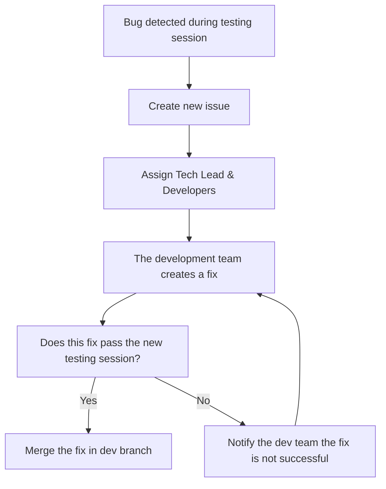

# Test plan

Table of contents

- [Test plan](#test-plan)
  - [1. Introduction](#1-introduction)
  - [2. Test Environment](#2-test-environment)
    - [2.1. Hardware Platform](#21-hardware-platform)
      - [2.1.1. FPGA Board](#211-fpga-board)
      - [2.1.2. Interfaces](#212-interfaces)
    - [2.2. Software Tools](#22-software-tools)
    - [2.3. Test Equipment](#23-test-equipment)
  - [3. Scope of Testing](#3-scope-of-testing)
    - [3.1. In Scope](#31-in-scope)
    - [3.2. Out of Scope](#32-out-of-scope)
  - [4. Test Objectives](#4-test-objectives)
  - [5. Testing Strategy](#5-testing-strategy)
    - [5.1. Test Methodology](#51-test-methodology)
      - [5.1.1. BlackBox Testing\[^5\]](#511-blackbox-testing5)
      - [5.1.2. Simulation Testing](#512-simulation-testing)
      - [5.1.3. Hardware Testing](#513-hardware-testing)
      - [5.1.4. Regression Testing\[^6\]](#514-regression-testing6)
    - [5.2. Test Cases](#52-test-cases)
    - [5.3. Test Reports](#53-test-reports)
    - [5.4. Bug Lifecycle](#54-bug-lifecycle)
    - [6. Testing Criteria](#6-testing-criteria)
      - [6.1. Entry Criteria](#61-entry-criteria)
      - [6.2. Exit Criteria](#62-exit-criteria)
      - [6.3. Suspension Criteria](#63-suspension-criteria)
      - [6.4. Resumption Criteria](#64-resumption-criteria)
      - [7. Risks \& Assumptions](#7-risks--assumptions)
      - [8. Deliverables](#8-deliverables)
      - [9. Glossary](#9-glossary)

## 1. Introduction

This document outlines the test plan for verifying and validating the Frogger game developed in Verilog[^2] for execution on the Go Board FPGA[^1] platform. The objective is to ensure that the game functions correctly, both in terms of gameplay logic, and interaction with the hardware peripherals (7-segment displays, switches, LEDs).

## 2. Test Environment

The test environement includes the hardware, the firmware and the development tools necessary for testing the Frogger game that will be uploaded on the FPGA[^1].

### 2.1. Hardware Platform

#### 2.1.1. FPGA Board

- Go Board FPGA Platform
  - Lattice ICE40 HX1K FPGA
  - Mini USB
  - Four Settable LEDs
  - Four Push-Buttons
  - A Dual 7-Segment LED Display
  - VGA Connector
  - External Connector (PMOD)
  - 25 MHz on-board clock
  - 1Kb Flash for booting up the FPGA

The defaut settings of the hardware won't be changed to ensure compatibility of our program among all Go Boards. You can refer to the [Go Board electronic schematic](https://nandland.com/wp-content/uploads/2022/06/Go_Board_V1.pdf) to ensure all the parameters of your Go Board corresponds to the factory defaults.

#### 2.1.2. Interfaces

**Input:**

- Push-Buttons for Frogger control

**Output:** 

- VGA Display for rendering game visuals
- Settable LEDs to display the remaining lives and status of the game
- Dual 7-Segment LED Display to indicate the score of the user

### 2.2. Software Tools

**Language:**

- Verilog HDL (Hardware Description Language): This language will be used to design and verify the electronic systems of our game. It is the support of the game mechanics and the display management.

**Simulation[^4] Tool:** 

- [EDAPlayGround](edaplayground.com) - This website will be used to thoroughly test the code before being synthesized and deployed to hardware. You will need to create an account and use the following options the "Tools & Simulators" section in order to simulate all of your snippets.
  - **Simulator Used:** Icarus Verilog 12.0
  - **Compile Options:** `-Wall -g2012`
  - **Additional Tools:** Usage of EPWave to verify the state of every variable.

**Synthesis[^3] Tool:**

- [Apio v.0.9.5](https://apiodoc.readthedocs.io/en/stable/index.html) will be used for synthesizing the Verilog code and to create the bitstream for the FPGA.
You can follow [this tutorial](https://nandland.com/set-up-apio-fpga-build-and-program/) to get APIO installed on your machine.

<!-- Potentially missing STA Tools, further investigations on this subject will be done -->

**Version Control & Issue Tracking[^8]:**

- To track all changes among the codebase of the project, we will leverage the features of GitHub, a version control website, built on top of Git. You can see more details about the usage we make of GitHub looking at [the functional specification document](../functional_specifications/functional_specifications.md).

- GitHub issues is a built-in feature of GitHub, allowing us to describe precisely the problems encountered during the testing phase.

  We define:

  - **Firmware bugs:** Unexpected behaviours of the program
  - **Missing feature:** Critical functions not implemented in the program
  - **Documentation:** Review of the documentation documents and the code
  - **Task allocation:** Define assignees for the task pointed out by the issue

- In order to make our issues consistent from one to antoher, we decided to use issue templates, a feature allowing people to create an issue by filling simple questions. This allows use to manage assignees more simply, as well as facilitating the tags implementation.

### 2.3. Test Equipment

- **Monitor:** LCD monitor EK1 Series-EK251Q.
- **Input Device:** The only inputs will be the Physical buttons located on the Go Board FPGA.
- **Non-Graphical Outputs:** 4 Settable LEDs and Dual 7-Segment LED Display wired on the Go Board.

## 3. Scope of Testing

The scope of testing of Frogger's clone encompasses all key requirements pointed out by the client and mentionned in the specifications. It will ensure the correctness of the exectued actions, the execution of a smooth gameplay and correct system performance on the Go Board.

### 3.1. In Scope

- **Game Logic & Behaviour:**
  - Frog movements based on user input in the following directions: Up, Down, Left, Right.
  - Collision detection with enemies (cars)
  - Scoring system when reaching the top of a level
  - Game states management to handle game overs and level completions

- **Hardware interfaces:**
  - Buttons to control Frogger's movement.
  - VGA output for visualizing the game elements.
  - LED indicators to indicate remaining lives.

- **Performance:**
  - Verify response time between inputs and display.
  - Ensure the game runs smoothly at a constant framerate.
  - Acknowledge the program's logic and timings.

### 3.2. Out of Scope

The following elements will nor be covered in the test plan, nor in the test cases:

- **Advanced Audio & Sound Effects**
  - Audio functionality (if any) has no output interface on the Go-Board, and consequently, won't be part of the testing scope.
- **New Hardware Implmentations:**
  - To ensure our Frogger clone can be executed on any Go Board, new hardware implementation is not planned and won't be reviewed.
- **Addition of a game menu:**
  - The addition of a screen like this one could be a valuable feature, however, it is not part of the game mechanics, and consequently, won't be reviewed.

## 4. Test Objectives

The objective of the testing phase of Frogger is to rigorously evaluate that our clone meets the requirements and objectives mentionned in the document given by the client, but also in the specifications. Consequently, the testing phase will focus on verifying the following points:

1. Validate Requirements - Core gameplay features

    Those requirements represent the MVP[^7] expected by the end of the project. Referring to the client's expectations, we should, at least, validate the following points:

    - Having a 32-pixel wide white square representing the frog. This square can be moved using the push buttons..
    - There must always be at least one car displayed on the screen. It will be represented as a 32-pixel wide white square.
    - There should be at least 1 level, meaning the level resets when the frog reaches the top.

2. Validate Objectives - Nice-to-have features

    These objectives are not mandatory to validate the submission to the client. However, these are additions we decided to implement in the final game.

    - The frog shall be shown as a sprite that looks like a real frog and be coloured.
    - A maximum of 16 cars should be present on the screen at a time, each car having the possibility to move at its own pace.
    - There should be at least 8 levels in the game. The difficulty among those levels should be increasing.

3. Test I/O Responsiveness & Accuracy

    As the product will be a game, we need to assess it is playable. Consequemtly, all the outputs will be checked to validate the specifications requirements.

    - All user actions via buttons is captured and triggerred only once per click. Information is correctly processed and moves the frog.
    - Verify correct alignments, with elements appear and update in the correct tiles.
    - The gameplay should be fluid, with a constant framerate and correct timings between interactions.

## 5. Testing Strategy

Our strategy employs a multifaceted approach which will consists in multiple phases of testing to identify issues early on in the project.

The test phase will be ran 

### 5.1. Test Methodology

#### 5.1.1. BlackBox Testing[^5]

To ensure a correct delivery in the project's timeframe, we need to validate early on if the functionalities are working on our app without focusing on the implementation of those features.

This will allow us to validate the core functionalities early on and focus on iterating to implement less critical features.

For this test phase, we will solely test the solutions via gameplay sessions.

<!-- To verify -->

#### 5.1.2. Simulation Testing

FPGAs are a blackbox executing code without any possibility of simple debugging, apart from creating a logic analyzer which would only be used only once. Rather than going for this extensive solution, we will use simulation[^4] to ensure the states of each component follow the specifications' instructions, but also verify if the specifications themselves are accurate.

As mentionned in the [Test Environment section](#22-software-tools), we are going to use [EDAPlayGround](edaplayground.com), a website on which we can execute our Verilog and test components independently, but also in the game environment.

Simulation testing on EDAPlayGround introduces various keywords helping us getting more precise results on the executed tests:

- `$dumpfile("dump.vcd");`
- `$dumpvars;`
- `assert();`: This statement asserts a component in our FPGA design has the same value as what our exepectation. If the assertion is false, the testing breaks automatically.
- `#10`: 10 here can be replaced by any positive integer to represent the number of clock cycles during which we have to wait to execute the code following the statement.

The simulations tests scripts will be stored in the [simulations folder](./simulations/), and be updated to test every new addition to the Frogger clone.

#### 5.1.3. Hardware Testing

Some behaviours cannot be simulated, consequently, we will have to go through game testing sessions which will be using the Go Board.

<!-- To complete -->

#### 5.1.4. Regression Testing[^6]

To validate new additions and fixes to the firmware, the whole test bed will be ran every time code will be merged in the dev branch.

This will allow the team to get insights on the progression of the development, but also on the quality of the code produced.

<!-- To complete -->

### 5.2. Test Cases

All of our codebase will be tested following the defined [test cases](./test_cases.md). Those test cases are using all the methodologies explained in the [Methodology Section](#51-test-methodology).

### 5.3. Test Reports

Each testing session consists in testing all the existing test cases. After each testing session, the results will be added into a [Google Sheets Document](https://docs.google.com/spreadsheets/d/13jn9MZXwvPJthTED8lPlTzNpH2iK69MnvhQDEM3IoZw/edit?usp=sharing).

This will allow the development team to know which test cases failed on a run by run basis, helping them identify the points where fixes should be made to make the most faithful clone of Frogger. It will also help them track their progression over time, and will help managment know if the allocated time and resources to testing and development are sufficient or not.

After each test execution, a test report will be added to the [Test Reports](./test-reports/) folder, linking all the identified issues and summarizing the overall 

### 5.4. Bug Lifecycle

### 6. Testing Criteria

####  6.1. Entry Criteria

To ensure relevant test reports and provide insights on the firmware development progression, the following points need to be validated:

- All the necessary documentation and requirement information should be available in the repository to ensure consistent testing. It will also allow testers to operate the system correctly.
- All the needed software tools including the testing tools must have been successfully installed and should work properly.
- All the hardware platforms must have been successfully installed, configured and functioning properly.
- The test environment, including the hardware, the firmware, and issue templates must be ready.
- The test scenarios, test cases and testing suite have been reviewed.
- Testers must be familiar with the product's specific features and expected functionalities.
- All the core features defined for the MVP[^7] in the functional specifications have been implemented.

#### 6.2. Exit Criteria

In order to consider the test phase as completed, the following points should have been validated:

- All the tests marked with with the criticality "High" and "Medium" should pass successfully.
- At least 95% of all tests (including "Low" criticality tests) must pass.
- All the identified issues have been addressed and resolved.
- All the documentation should have been verified, ensuring correctness of information and vocabulary precision.

#### 6.3. Suspension Criteria

In case of a critical bug affecting the whole testing process, the testing phase can be temporarily suspended. The following cases can trigger this suspension:

- Hardware problems/failure.
- Assigned resources are not available when required by the quality assurance team.
- Significant change in requirements asked by the client.
- The firmware contains serious defects limiting or preventing testing (e.g. `apio upload` command returns an error).

#### 6.4. Resumption Criteria

To resume the testing phase, the cause of the suspension should have been identified, addressed and resolved.

#### 7. Risks & Assumptions

| Risk                                                   | Mitigation                                                                 |
| ------------------------------------------------------ | -------------------------------------------------------------------------- |
| The provided codebase isn't working                    | Find the origin of the error and create a new issue to inform the dev team |
| Limited time or resources allocated because of delays | Test the most critical features first                                      |
| A hardware failure occurs                              | Try to fix the hardware or share it with other teams if needed             |

#### 8. Deliverables

- Test Plan
- Test Cases Description
- Test Reports
- Testing resources and scripts

#### 9. Glossary

[^1]: Stands for Field Programmable Gate Array - A type of hardware used to execute custom logic circuits in parallel.

[^2]: A hardware description language used to model electronic systems.

[^3]: The process of converting high-level hardware descriptions (e.g., Verilog) into a lower-level representation that can be programmed onto an FPGA.

[^4]: Testing the functionality of a design by emulating its behavior in software.

[^5]: A method of testing that focuses on inputs and outputs without looking at internal logic.

[^6]: Testing existing functionality to ensure that new changes or fixes have not introduced new issues.

[^7]: Stands for Minimum Viable Product – A version of a product with just enough features to be usable by early adopters.

[^8]: A system for managing bugs, features, and other tasks during development.