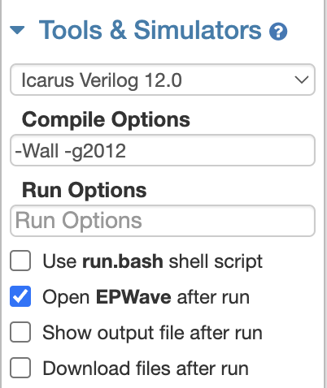
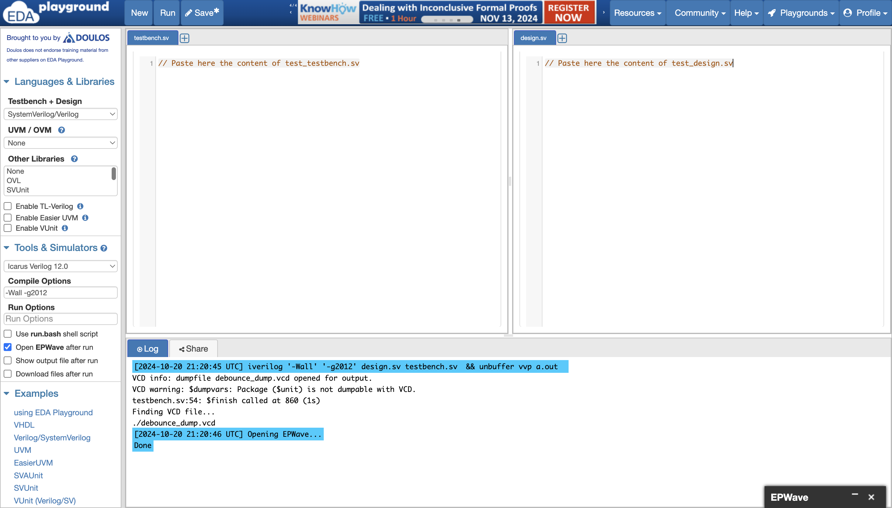
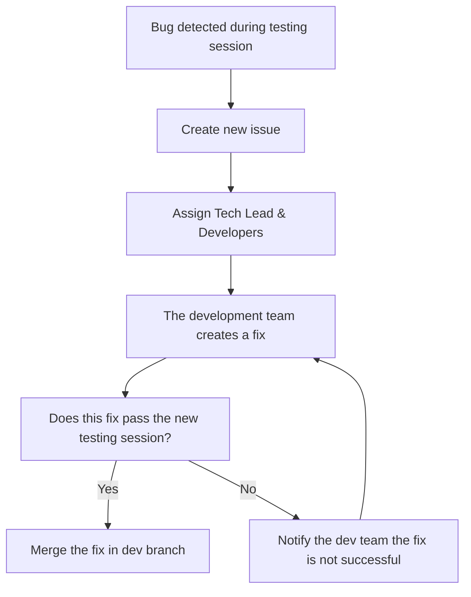

# Test plan

Table of contents

- [Test plan](#test-plan)
  - [1. Introduction](#1-introduction)
  - [2. Test Environment](#2-test-environment)
    - [2.1. Hardware Platform](#21-hardware-platform)
      - [2.1.1. FPGA Board](#211-fpga-board)
      - [2.1.2. Interfaces](#212-interfaces)
    - [2.2. Software Tools](#22-software-tools)
    - [2.3. Test Equipment](#23-test-equipment)
  - [3. Scope of Testing](#3-scope-of-testing)
    - [3.1. In Scope](#31-in-scope)
    - [3.2. Out of Scope](#32-out-of-scope)
  - [4. Test Objectives](#4-test-objectives)
  - [5. Testing Strategy](#5-testing-strategy)
    - [5.1. Test Methodology](#51-test-methodology)
      - [5.1.1. BlackBox Testing\[^5\]](#511-blackbox-testing5)
      - [5.1.2. Simulation Testing](#512-simulation-testing)
      - [5.1.3. Hardware Testing\[^4\]](#513-hardware-testing4)
      - [5.1.4. Regression Testing](#514-regression-testing)
    - [5.2. Test Cases](#52-test-cases)
    - [5.3. Test Reports](#53-test-reports)
    - [5.4. Bug Lifecycle](#54-bug-lifecycle)
    - [6. Testing Criteria](#6-testing-criteria)
      - [6.1. Entry Criteria](#61-entry-criteria)
      - [6.2. Exit Criteria](#62-exit-criteria)
      - [6.3. Suspension Criteria](#63-suspension-criteria)
      - [6.4. Resumption Criteria](#64-resumption-criteria)
      - [7. Risks \& Assumptions](#7-risks--assumptions)
      - [8. Deliverables](#8-deliverables)
      - [9. Glossary](#9-glossary)

## 1. Introduction

This document outlines the test plan for verifying and validating the Froggo game developed in Verilog[^2] for execution on the Go Board FPGA[^1] platform. The objective is to ensure that the game functions correctly, both in terms of gameplay logic, and interaction with the hardware peripherals (7-segment displays, switches, LEDs).

The whole 

## 2. Test Environment

The test environement includes the hardware, the firmware and the development tools necessary for testing the Froggo game that will be uploaded on the FPGA[^1].

### 2.1. Hardware Platform

#### 2.1.1. FPGA Board

- Go Board FPGA Platform
  - Lattice ICE40 HX1K FPGA
  - Mini USB
  - Four Settable LEDs
  - Four Push-Buttons
  - A Dual 7-Segment LED Display
  - VGA Connector
  - External Connector (PMOD)
  - 25 MHz on-board clock
  - 1Kb Flash for booting up the FPGA

The defaut settings of the hardware won't be changed to ensure compatibility of our program among all Go Boards. You can refer to the [Go Board electronic schematic](https://nandland.com/wp-content/uploads/2022/06/Go_Board_V1.pdf) to ensure all the parameters of your Go Board corresponds to the factory defaults.

#### 2.1.2. Interfaces

**Input:**

- Push-Buttons for Froggo control

**Output:** 

- VGA Display for rendering game visuals
- Settable LEDs to display the remaining lives and status of the game
- Dual 7-Segment LED Display to indicate the score of the user
- PMOD to transmit data from and to peripherals. This interface is not currently planned to be used in the project, but it might be used in future versions (to connect multiple Go Boards for instance).

### 2.2. Software Tools

**Language:**

- Verilog HDL (Hardware Description Language): This language will be used to design and verify the electronic systems of our game. It is the support of the game mechanics and the display management.

**Simulation[^4] Tool:** 

- [EDAPlayGround](edaplayground.com) - This website will be used to thoroughly test the code before being synthesized and deployed to hardware. You will need to create an account and use the following options the "Tools & Simulators" section in order to simulate all of your snippets.
  - **Simulator Used:** Icarus Verilog 12.0
  - **Compile Options:** `-Wall -g2012`
  - **Additional Tools:** Usage of EPWave to verify the state of every variable.

You can refer to this image to make sure your configuration matches the one exepected for the testing phase:

**Synthesis[^3] Tool:**

- [Apio v.0.9.5](https://apiodoc.readthedocs.io/en/stable/index.html) will be used for synthesizing the Verilog code and to create the bitstream for the FPGA.
You can follow [this tutorial](https://nandland.com/set-up-apio-fpga-build-and-program/) to get APIO installed on your machine.

**Version Control & Issue Tracking[^8]:**

- To track all changes among the codebase of the project, we will leverage the features of GitHub, a version control website, built on top of Git. You can see more details about the usage we make of GitHub looking at [the functional specification document](../functional_specifications/functional_specifications.md).

- GitHub issues is a built-in feature of GitHub, allowing us to describe precisely the problems encountered during the testing phase.

  We define:

  - **Firmware bugs:** Unexpected behaviours of the program
  - **Missing feature:** Critical functions not implemented in the program
  - **Documentation:** Review of the documentation documents and the code
  - **Task allocation:** Define assignees for the task pointed out by the issue

- In order to make our issues consistent from one to antoher, we decided to use issue templates, a feature allowing people to create an issue by filling simple questions. This allows use to manage assignees more simply, as well as facilitating the tags implementation.

- We will use the GitFlow branching strategy to ensure a smooth integration of features in an incremental manner to the product. This will avoid us most of the conflicts caused by incremental development, as well as ensuring changes made for testing are not interfering with the acstive development.

### 2.3. Test Equipment

- **Monitor:** LCD monitor EK1 Series-EK251Q.
- **Input Device:** The only inputs will be the Physical buttons located on the Go Board FPGA.
- **Non-Graphical Outputs:** 4 Settable LEDs and Dual 7-Segment LED Display wired on the Go Board.

## 3. Scope of Testing

The scope of testing of Froggo's clone encompasses all key requirements pointed out by the client and mentionned in the specifications. It will ensure the correctness of the exectued actions, the execution of a smooth gameplay and correct system performance on the Go Board.

### 3.1. In Scope

- **Game Logic & Behaviour:**
  - Frog movements based on user input in the following directions: Up, Down, Left, Right.
  - Collision detection with enemies (cars)
  - Scoring system when reaching the top of a level
  - Game states management to handle game overs and level completions

- **Hardware interfaces:**
  - Buttons to control Froggo's movement.
  - VGA output for visualizing the game elements.
  - LED indicators to indicate remaining lives.

- **Performance:**
  - Verify response time between inputs and display.
  - Ensure the game runs smoothly at a constant framerate.
  - Acknowledge the program's logic and timings.

### 3.2. Out of Scope

The following elements will nor be covered in the test plan, nor in the test cases:

- **Advanced Audio & Sound Effects**
  - Audio functionality (if any) has no output interface on the Go-Board, and consequently, won't be part of the testing scope.
- **New Hardware Implmentations:**
  - To ensure our Froggo clone can be executed on any Go Board, new hardware implementation is not planned and won't be reviewed.
- **Addition of a game menu:**
  - The addition of a screen like this one could be a valuable feature, however, it is not part of the game mechanics, and consequently, won't be reviewed.

## 4. Test Objectives

The objective of the testing phase of Froggo is to rigorously evaluate that our clone meets the requirements and objectives mentionned in the document given by the client, but also in the specifications. Consequently, the testing phase will focus on verifying the following points:

1. Validate Requirements - Core gameplay features

    Those requirements represent the MVP[^7] expected by the end of the project. Referring to the client's expectations, we should, at least, validate the following points:

    - Having a 32-pixel wide white square representing the frog. This square can be moved using the push buttons..
    - There must always be at least one car displayed on the screen. It will be represented as a 32-pixel wide white square.
    - There should be at least 1 level, meaning the level resets when the frog reaches the top.

2. Validate Objectives - Nice-to-have features

    These objectives are not mandatory to validate the submission to the client. However, these are additions we decided to implement in the final game.

    - The frog shall be shown as a sprite that looks like a real frog and be coloured.
    - A maximum of 16 cars should be present on the screen at a time, each car having the possibility to move at its own pace.
    - There should be at least 8 levels in the game. The difficulty among those levels should be increasing.

3. Test I/O Responsiveness & Accuracy

    As the product will be a game, we need to assess it is playable. Consequemtly, all the outputs will be checked to validate the specifications requirements.

    - All user actions via buttons is captured and triggerred only once per click. Information is correctly processed and moves the frog.
    - Verify correct alignments, with elements appear and update in the correct tiles.
    - The gameplay should be fluid, with a constant framerate close to 60Hz and correct timings between interactions with a global response time of about 1ms.

## 5. Testing Strategy

Our strategy employs a multifaceted approach consisting of multiple phases of testing to identify issues early on in the project and ensure a smooth, bug-free experience on the hardware. Testing will be conducted both in simulation and on the actual FPGA hardware, leveraging various tools and methodologies.

The test phase will follow a structured timeline:

1. **Initial Functional Testing**: Begin with black-box testing to ensure core gameplay functionality (like frog movement and collision detection).
2. **Simulations and Edge Case Handling**: Test key game components using Verilog simulation tools to verify edge cases, timing, and logic.
3. **Real-Time Hardware Validation**: Perform tests on the FPGA hardware to verify real-world performance, responsiveness, and integration with physical inputs (push-buttons) and outputs (VGA, LEDs, etc.).
4. **Regression Testing**[^6]: Ongoing checks to ensure new changes don't break existing functionality.

### 5.1. Test Methodology

#### 5.1.1. BlackBox Testing[^5]

This testing method will allow the team to validate if the features work as expected without diving into the underlying implementation. The primary goal is to ensure that core game features, including gameplay logic and user interactions, operate as expected.

- **Frog Movement**: Test that each directional input (Up, Down, Left, Right) moves the frog to the corresponding position on the screen.
- **Collision Detection**: Verify that the frog "dies" and loses a life when it collides with a car.
- **Score Incrementation**: Ensure that the score increases when the frog reaches the top of the screen.
- **Game Over**: Confirm the game transitions to the "Game Over" state when the player's lives reach zero.
  
This will be done via gameplay simulation, using the push buttons for input and checking the screen (VGA) and LEDs for output feedback.

#### 5.1.2. Simulation Testing

Since debugging on FPGAs is difficult, simulation testing will be a key method for verifying the behavior of the Froggo clone before uploading it to the hardware. This phase ensures that every component behaves correctly in isolation and as part of the overall system.

We will simulate:

- **Collision logic**: Ensure that when the frog and car occupy the same tile, the collision is detected.
- **Movement timing**: Validate that the frog and cars move according to the clock timing requirements.
- **Score updates and screen refresh**: Ensure that the score updates and screen refresh occur without errors or lag.

Simulation scripts will be created using [EDAPlayGround](https://edaplayground.com), with clear output (VCD dumps) to examine and verify internal states.

Each of the simulation tests, referred to as *test*, are in their own directory, indicating the test targetted component. You will find two files in each test directory:

- ***test*_design.sv**: This corresponds to the module under test in EDAPlayGround. It is also the same module as the one contained in the code base.
- ***test*_testbench.sv**: This file refers to the tests and assertions being ran to test the behaviour of the unit under test.

You can copy and paste the content of these files from the repository to EDAPlayground following the following model:

Testing **Edge Cases**:
- **Simultaneous button presses**: Ensure that multiple buttons do not cause unexpected behavior.

#### 5.1.3. Hardware Testing[^4]

Hardware testing will ensure that the game functions properly on the Go-Board FPGA, handling real-world interactions with the physical buttons and providing accurate visual feedback via the VGA display and LEDs.

The tests will include:

- **Input Responsiveness**: Validate that button inputs are registered and debounced correctly.
- **VGA Display**: Check that the frog and cars are displayed properly and smoothly on the screen.
- **LED Indicators**: Ensure that the LEDs display the remaining lives and the game’s state correctly (e.g., a "Game Over" indicator when all lives are lost).
- **7-Segment Display**: Ensure the score is updated accurately and is visible to the user.

During hardware testing, various scenarios (e.g., quickly repeated inputs or no input at all) will be simulated to ensure robustness.

#### 5.1.4. Regression Testing 

After adding new features or fixing bugs, regression testing[^6] will be crucial to verify that the new changes do not inadvertently break existing features.

Key focus areas will include:

- **Gameplay**: Ensuring movement, collision, and scoring still work as expected.
- **User Interface**: Verifying the VGA display and 7-segment display still function correctly.
- **Performance**: Checking for frame drops or unexpected delays in response time.

By re-running the full suite of tests after each update, we can ensure that any introduced issues are caught early.

Runs of the full suite will be done after each merge into the dev or the main branch, ensuring the correctness and robustness of the submitted code.

### 5.2. Test Cases

Test cases will be created for each feature and interaction, and will be updated as new features are added or bugs are discovered. These will be managed through GitHub Issues and documented in the [test_cases.md](./test_cases.md) file, ensuring traceability.

Key test cases:
1. **Movement**: Ensure the frog moves one step per button press in the expected direction.
2. **Collision**: Verify collision detection with cars.
3. **Score Incrementation**: Ensure the score increments when the frog reaches the top.
4. **Life Decrement**: Verify that the frog loses a life upon collision and that the game correctly resets the frog's position.
5. **Game Over**: Confirm that the game ends after the player loses all lives and properly displays the "Game Over" screen.

### 5.3. Test Reports

Each test run will be documented in detailed test reports. A test session will result in a report summarizing:

- **Tested Features**: What was tested during this session.
- **Outcomes**: What passed, what failed.
- **Issues Found**: Description of any bugs or errors.
- **Next Steps**: Actions that need to be taken to resolve any discovered issues.

Reports will be stored in the [Test Reports](https://github.com/algosup/2024-2025-project-1-fpga-team-8/tree/main/documents/quality_assurance/test_reports) folder, allowing the team to track test progress and results over time. An overarching summary will be updated to reflect progress.

You can also refer to the [history of testing](https://docs.google.com/spreadsheets/d/13jn9MZXwvPJthTED8lPlTzNpH2iK69MnvhQDEM3IoZw/edit?gid=0#gid=0) which covers all the testing made during the project.

### 5.4. Bug Lifecycle

The bug lifecycle, described via the mermaid diagram, ensures all issues are managed efficiently from identification to resolution.

### 6. Testing Criteria

####  6.1. Entry Criteria

To ensure relevant test reports and provide insights on the firmware development progression, the following points need to be validated:

- All the necessary documentation and requirement information should be available in the repository to ensure consistent testing. It will also allow testers to operate the system correctly.
- All the needed software tools including the testing tools must have been successfully installed and should work properly.
- All the hardware platforms must have been successfully installed, configured and functioning properly.
- The test environment, including the hardware, the firmware, and issue templates must be ready.
- The test scenarios, test cases and testing suite have been reviewed.
- Testers must be familiar with the product's specific features and expected functionalities.
- All the core features defined for the MVP[^7] in the functional specifications have been implemented.

#### 6.2. Exit Criteria

In order to consider the test phase as completed, the following points should have been validated:

- All the tests marked with with the criticality "High" and "Medium" should pass successfully.
- At least 95% of all tests (including "Low" criticality tests) must pass.
- All the identified issues have been addressed and resolved.
- All the documentation should have been verified, ensuring correctness of information and vocabulary precision.

#### 6.3. Suspension Criteria

In case of a critical bug affecting the whole testing process, the testing phase can be temporarily suspended. The following cases can trigger this suspension:

- Hardware problems/failure.
- Assigned resources are not available when required by the quality assurance team.
- Significant change in requirements asked by the client.
- The firmware contains serious defects limiting or preventing testing (e.g. `apio upload` command returns an error).

#### 6.4. Resumption Criteria

To resume the testing phase, the cause of the suspension should have been identified, addressed and resolved.

#### 7. Risks & Assumptions

| Risk                                                     | Mitigation                                                                                                                                                                   |
| -------------------------------------------------------- | ---------------------------------------------------------------------------------------------------------------------------------------------------------------------------- |
| The provided codebase isn't working                      | Find the origin of the error and create a new issue to inform the dev team. Pause the testing process.                                                                       |
| Limited time or resources allocated because of delays    | Test the most critical features first                                                                                                                                        |
| A hardware failure occurs                                | Use the other Go Boards at our disposal before trying to fix the defects on the failed hardware. Lastly, share hardware among teams to fix the problem.                      |
| There are manufacturing variations between each Go Board | Inform Russel from a problem, test all available Go Boards to know the percetage of them affected by the defect. Solely use the boards which are not affected by the defect. |

#### 8. Deliverables

| Deliverable                   | Release/Updates Frequence                             |
| ----------------------------- | ----------------------------------------------------- |
| Test Plan                     | 1 Major Releases with daily iterations for refinement |
| Test Cases Description        | 1 Major Releases with daily iterations for refinement |
| Test Reports                  | Released after each test session                      |
| Testing resources and scripts | 1 Major Releases with daily iterations for refinement |

#### 9. Glossary

[^1]: Stands for Field Programmable Gate Array - A type of hardware used to execute custom logic circuits in parallel.

[^2]: A hardware description language used to model electronic systems.

[^3]: The process of converting high-level hardware descriptions (e.g., Verilog) into a lower-level representation that can be programmed onto an FPGA.

[^4]: Testing the functionality of a design by emulating its behavior in software.

[^5]: A method of testing that focuses on inputs and outputs without looking at internal logic.

[^6]: Testing existing functionality to ensure that new changes or fixes have not introduced new issues.

[^7]: Stands for Minimum Viable Product – A version of a product with just enough features to be usable by early adopters.

[^8]: A system for managing bugs, features, and other tasks during development.