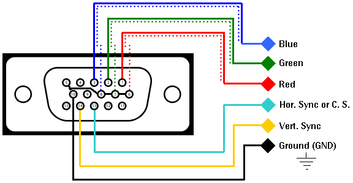
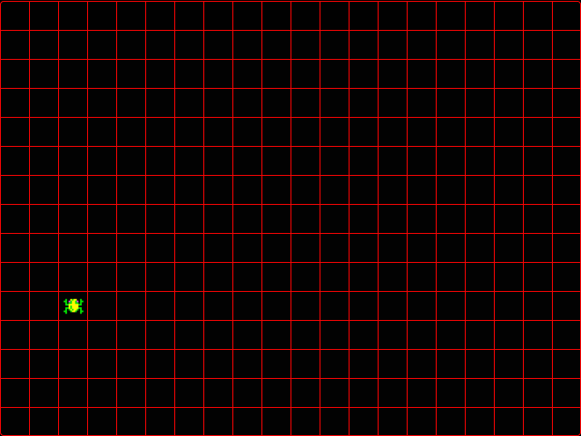

<center>

# Technical specifications

<hr>
Created by: Aurélien FERNANDEZ
<hr>
</center>


<details>
<summary>Table of content</summary>

- [Technical specifications](#technical-specifications)
  - [1 - Project definitions](#1---project-definitions)
  - [1.1 - What is this project?](#11---what-is-this-project)
  - [1.2 - Provided hardware](#12---provided-hardware)
    - [1.2.1 - Go boards](#121---go-boards)
      - [1.2.1.1- Overview](#1211--overview)
      - [1.2.1.1 - Components of the board](#1211---components-of-the-board)
    - [1.2.2 - Screen](#122---screen)
  - [1.3 - File architecture](#13---file-architecture)
  - [2 - Development environment](#2---development-environment)
    - [2.1 - Computers](#21---computers)
    - [2.2 - Programming language](#22---programming-language)
      - [2.2.1 What is an FPGA?](#221-what-is-an-fpga)
      - [2.2.2 - What is Verilog?](#222---what-is-verilog)
      - [2.2.3 - Why Verilog?](#223---why-verilog)
  - [3 - Development rules](#3---development-rules)
    - [3.1 Naming conventions](#31-naming-conventions)
    - [3.2 - Comments](#32---comments)
    - [3.3 - Code conventions](#33---code-conventions)
  - [4 - Technical implementations](#4---technical-implementations)
    - [4.1 - Features required](#41---features-required)
    - [4.2 - Display the game](#42---display-the-game)
    - [4.2.1 - Frame management](#421---frame-management)
    - [4.2.2 - Creating the map](#422---creating-the-map)
      - [4.2.2.1 - The grid](#4221---the-grid)
      - [4.2.2.2 - Bitmap](#4222---bitmap)
    - [4.2.3 - Sprites](#423---sprites)
      - [4.2.3.1 - Frog](#4231---frog)
      - [4.2.3.2 - Cars](#4232---cars)
      - [4.2.3.3 - Logs](#4233---logs)
      - [4.2.3.4 - Tiles](#4234---tiles)
    - [4.3 - Control the frog](#43---control-the-frog)
    - [4.4 - Lane](#44---lane)
    - [4.5 - Cars](#45---cars)
      - [4.5.1 - Instantiation \& Output](#451---instantiation--output)
      - [4.5.2 - Speed and Direction](#452---speed-and-direction)
      - [4.5.3 - Density](#453---density)
      - [4.5.4 - Table](#454---table)
    - [4.6 - Logs](#46---logs)
      - [4.6.1 - Speed](#461---speed)
      - [4.6.2 - Density](#462---density)
      - [4.6.3 - Size](#463---size)
      - [4.6.4 - Table](#464---table)
      - [4.7 - Turtles](#47---turtles)
    - [4.8 - Level system](#48---level-system)
    - [4.9 - Collision system](#49---collision-system)
    - [4.5 - Lives system](#45---lives-system)
  - [Glossary](#glossary)
</details>


## 1 - Project definitions

## 1.1 - What is this project?

This project is a reproduction of the game "Frogger" published in 1981 by Konami.

## 1.2 - Provided hardware

### 1.2.1 - Go boards

#### 1.2.1.1- Overview
For this project, we were given a total of 7 [go boards](https://nandland.com/the-go-board/) which can be programmed using Verilog[^1] or VHDL.

A go board is an FPGA[^2] that can be reprogrammed at any time. it has been created by the company [NandLand](https://nandland.com/) to allow students and beginners to learn about FPGAs[^2].

Along with the boards we were given 7 books written by Russell MERRICK, our teacher for this project. This book contains the different usages and subtleties of Verilog.

#### 1.2.1.1 - Components of the board


- Lattice ICE40 HX1K FPGA
- Mini USB
- Four Settable LEDs
- Four Push-Buttons
- A Dual 7-Segment LED Display
- VGA Connector
- External Connector (PMOD)
- 25 MHz on-board clock
- 1Mb Flash for booting up the FPGA

| Component   | Name used in code | Pin |
| ----------- | ----------------- | --- |
| LED 1       | o_LED_1           | 056 |
| LED 2       | o_LED_2           | 057 |
| LED 3       | o_LED_3           | 059 |
| LED 4       | o_LED_4           | 060 |
| Switch 1    | i_Switch_1        | 053 |
| Switch 2    | i_Switch_2        | 051 |
| Switch 3    | i_Switch_3        | 054 |
| Switch 4    | i_Switch_4        | 052 |
| VGA HSync   | o_VGA_HSync       | 026 |
| VGA VSync   | o_VGA_VSync       | 027 |
| VGA red 0   | o_VGA_Red_0       | 036 |
| VGA red 1   | o_VGA_Red_1       | 037 |
| VGA red 2   | o_VGA_Red_2       | 040 |
| VGA green 0 | o_VGA_Grn_0       | 029 |
| VGA green 1 | o_VGA_Grn_1       | 030 |
| VGA green 2 | o_VGA_Grn_2       | 033 |
| VGA blue 0  | o_VGA_Blu_0       | 028 |
| VGA blue 1  | o_VGA_Blu_1       | 041 |
| VGA blue 2  | o_VGA_Blu_2       | 042 |
| PMOD 1      | io_PMOD_1         | 065 |
| PMOD 2      | io_PMOD_2         | 064 |
| PMOD 3      | io_PMOD_3         | 063 |
| PMOD 4      | io_PMOD_4         | 062 |
| PMOD 5      | /                 | /   |
| PMOD 6      | /                 | /   |
| PMOD 7      | io_PMOD_7         | 078 |
| PMOD 8      | io_PMOD_8         | 079 |
| PMOD 9      | io_PMOD_9         | 080 |
| PMOD 10     | io_PMOD_10        | 081 |
| Segment 1 A | o_Segment1[0]     | 003 |
| Segment 1 B | o_Segment1[1]     | 004 |
| Segment 1 C | o_Segment1[2]     | 093 |
| Segment 1 D | o_Segment1[3]     | 091 |
| Segment 1 E | o_Segment1[4]     | 090 |
| Segment 1 F | o_Segment1[5]     | 001 |
| Segment 1 G | o_Segment1[6]     | 002 |
| Segment 2 A | o_Segment2[0]     | 100 |
| Segment 2 B | o_Segment2[1]     | 099 |
| Segment 2 C | o_Segment2[2]     | 097 |
| Segment 2 D | o_Segment2[3]     | 095 |
| Segment 2 E | o_Segment2[4]     | 094 |
| Segment 2 F | o_Segment2[5]     | 008 |
| Segment 2 G | o_Segment2[6]     | 096 |
| Clock       | i_Clk             | 015 |
| UART RX     | i_UART_RX         | 073 |
| UART TX     | i_UART_TX         | 074 |


The clock, operating at a frequency of 25Mhz translating to 25 000 000 cycles per second. 

The default parameters of the go board will remain unchanged, which means no component is added, removed or modified and the clock will hold the same frequency throughout the project.

### 1.2.2 - Screen

We were also provided with a screen that has a width of 1920 pixels and a height of 1080 pixels with a VGA cable to connect a board to the screen. The specific model of our screen is the LCD monitor EK1 Series-EK251Q.

## 1.3 - File architecture

```
FPGA Project
├── 📁documents
|   ├── 📁management
|   |   └── 📄project_charter.md
|   ├── 📁quality_assurance
|   |   ├── 📄test_plan.md
|   |   └── 📄test_cases.md
|   ├── 📁functional_specifactions
|   |   ├── 📁images
|   |   └── 📄functional_specifications.md
|   └── 📁technical_specifactions
|       ├── 📁images
|       └── 📄functional_specifications.md
└── 📁 src
    ├── 📁 sprites
    ├── apio.ini
    ├── go-board.pcf
    └── frogger_top.v
```

## 2 - Development environment

### 2.1 - Computers

Our team uses multiple machines to work on this project, such as:
- IBM-compatible laptops operating on Windows 11,
- MacBooks operating on MacOS Sequoia 15.0.

As for the IDE, we are using Visual Studio Code. Finally, to be able to upload a program to the board we all installed the tool [Apio](https://github.com/FPGAwars/apio/) on our machines.

### 2.2 - Programming language

#### 2.2.1 What is an FPGA?

Field-Programable Gate Arrays, in short FPGA, are alternatives to processors capable of executing multiple instructions in parallel whereas processors are executing the instructions sequentialy, one at the time. The logic blocks of the FPGA, used to perform the different calculations are configurable, this allows FPGAs to be highly versatile. All these advantages allow FPGAs to be faster than processors holding the same clock frequency in terms of calculations per cycles.

To summarise, here is the list of the different advantages of FPGAs:
- Highly flexible,
- Parallel processing,
- Reconfigurability,
- Fast prototyping.

FPGAs also possess downsides, here is the list of the different downsides:
- They cost more to produce than traditional circuit boards,
- They require more power to run than specialised circuit boards,
- They may be less performant than specialised circuit boards,
- They are generaly bigger physically than traditional circuit boards due to the fact that logic blocks are not centralised in a single unit but physcial components.

FPGAs are used in very specific fields, more precisely in military projects, in radars and in aerospace project such as satellites, they can also be used for projects requiring fast calculations or video processing but the FPGA are not generally suited for creating project such as applications or games.

#### 2.2.2 - What is Verilog?

The programming language used for this project is Verilog. It is a programming language specialised in the programming of FPGAs[^2]. Verilog possesses multiple particularities listed as:
- There is no order of execution, meaning that all lines present in a module are executed simultaneously, the only exceptions being the lines requiring specific conditions such as "always" and if-else conditions.
- Verilog belongs to a type of programming languages known as "hardware description languages" which are languages that are used to model electronic systems. Although the language is easier to read than assembly languages due to a syntax similar to C-like languages it manages component in a lower level than assembly language as it interacts directly with wires.

A verilog project is composed of multiple type of files such as:
- apio.ini: This is the file containing two value "top-module" and "board".
- .v files: Standing for verilog files, they contain the different functions used for the project, the file named after the "top-module" value is the one called upon running the program, the module contained in this file must have the same name as the file.
- .pcf file: This is the file containing the different inputs and outputs used for this project. The file must be named after the "board" value.
- .mem: Standing for memory, this file stores a matrix of values separated by whitespaces, the values can be called in the program at any given time.

#### 2.2.3 - Why Verilog?

Verilog is not the only HDL to exist, VHDL is another popular HDL compatible with our programming board. Here is the list following the reasoning as to why we are using Verilog:
- The use of Verilog is a requirement of the project.
- Verilog is the most popular hardware description language when working on FPGAs[^2].

## 3 - Development rules

In order to keep the repository clean and maintainable, we choose to follow specific conventions.

### 3.1 Naming conventions

Here is the list of the naming conventions regarding the repository and the file architecture of the project:
- **Branches**: pascalCase,
- **Folder & files**: snake_case,

Here is the naming conventions regarding Verilog:
- **Modules[^3]**: snake_case,
- **Wires**: w_[Name],
- **Registers**: r_[Name],
- **Inputs**: i_[Name],
- **Outputs**: o_[Name],
- **Parameters & defines**: [NAME].

Note that [Name] symbolises the name given to the element. \
e.g: 
```
reg r_Clock;
assign o_My_Led=1;
parameter MYPARAM = 20;
```

### 3.2 - Comments

The use of comments is crucial for the maintainability of a project is the use of comments. It allows collaborators and future developer to maintain and update the code without struggling on understanding the inner part of a program.

In Verilog comments can be written in multiple ways: 

In a Verilog file:
``` 
// This is a single line comment

/*
This is a multiline
comment
*/
```

In a PCF file:
```
## This is a comment
```

Comments should be regularly written to ensure the comprehension of the code of current and future developers and reviewers. 

### 3.3 - Code conventions

The code must follow few but strict rules such as:

- The file containing a module must be shorter than 20 character and clear enough to understand,
- The module contained in a file must have the same name as its file,
- The space between each level of indentation must be of 4 spaces.

## 4 - Technical implementations

### 4.1 - Features required

Here is a short summary of the features that are required for the success of this project. For a more detailed version of these features, refer to the [functional specifications](../functional_specifications/functional_specifications.md)
| Feature name | Description                                                                                                                                                                                                               |
| ------------ | ------------------------------------------------------------------------------------------------------------------------------------------------------------------------------------------------------------------------- |
| Move         | The player can move a playable character.                                                                                                                                                                                 |
| Life system  | The player possesses 3 lives, when this number reaches 0, a game over screen appears and the game resets.                                                                                                                 |
| Grid         | The screen is divided by a 13x13 grid, where each tiles is 32x32 pixels.                                                                                                                                                  |
| Grass        | 2 rows on the grid are composed of "grass" tiles, one at the bottom, the second in the middle of the screen.                                                                                                              |
| Road         | 5 rows on the grid are composed of "road" tiles, they all are between the two rows of "grass".                                                                                                                            |
| water        | 5 rows on the grid are composed of "water" tiles, they all are between the second rows of "grass" and the last row.                                                                                                       |
| Lilypads     | The last row is composed of 5 lilypads with walls on the left and right of each lilypad. When the player collides with every lilypads, the player wins, when the player collides with the walls, the player loses a life. |
| Cars         | Cars are moving through the screen from left to right or  from right to left, they can only appear on roads. When the player collides with a car, the player loses a life.                                                |
| Crocodiles   | Crocodiles are moving through the screen from left to right or from right to left, they can only appear on water. When the player collides with the mouth of a crocodile, the player loses a life.                        |
| turtles      | Turtles are moving through the screen from left to right or from right to left, they can only appear on water. Some turtles can go under water.                                                                           |
| Snakes       | Snakes are moving through the screen from left to right or from right to left, they can only appear on the second "grass" row. When the player collides with one, the player loses a life.                                |

### 4.2 - Display the game

To display images on our screen, we are using a VGA cable, due to the technical limitations of a VGA cable, we are limited to a size of 640x480 pixels as the active area with an inactive area of 794x525 pixels as seen in the following image.


The pins of a VGA cable are read from top right to bottom left as seen in the following image:


Here is the table of the different pins and their use:
| pin | use                        |
| --- | -------------------------- |
| 01  | Red                        |
| 02  | Green                      |
| 03  | Blue                       |
| 04  | Not connected              |
| 05  | Ground                     |
| 06  | Red return                 |
| 07  | Green return               |
| 08  | Blue return                |
| 09  | 5V                         |
| 10  | Ground                     |
| 11  | Not connected              |
| 12  | Serial Data Line (SDA)     |
| 13  | Horizontal synchronisation |
| 14  | Vertical synchronisation   |
| 15  | Clock                      |

To display on the screen the only pins required in the code are:

- **01 to 03**: To create a colour,
- **05 to 08**: To assign a ground to each color pin,
- **13**: The X position of the pixel to draw,
- **14**: The Y position of the pixel to draw,

### 4.2.1 - Frame management

 Knowing that our board has a frequency of 25Mhz, and that the screen used is of 794x525, translating to 416,850 pixels we can calculate the time needed to change a frame on the screen. For this, we only have to divide the number of pixels to change by the frequency of the clock:

 416850 / 25000000 = 0.01667

 Following this calculus, we can conclude it takes 0.01667 seconds to change a frame. Finally we can deduce that we can manage a framerate of 60 frame per second exceeding the limit of 30 frame per second of VGA.

### 4.2.2 - Creating the map

#### 4.2.2.1 - The grid
To create the map we are using a grid system, dividing the screen into 32x32 pixels tiles. With 32x32 cells, the grid result with a size of 15x13 cells filling the width as 15 cells equals 480 pixels. The height however leaves 224 pixels, which is intentional as in the original game this space is used to display the score and the high-score.

Here is the representation of the grid on our screen.


#### 4.2.2.2 - Bitmap

Additionally to the use of a grid, we are using a bitmap, the bitmap is a table representing the type of tiles the grid is composed of, we currently have 5 types of tiles:
- Grass/safe area,
- Road,
- Water,
- Lilypad,
- wall.

The bitmap is a two-dimensional array presented as such:
<center>

```
0 0 4 0 0 0 4 0 0 0 4 0 0 0 4 0 0 0 4 0
2 2 2 2 2 2 2 2 2 2 2 2 2 2 2 2 2 2 2 2 
2 2 2 2 2 2 2 2 2 2 2 2 2 2 2 2 2 2 2 2 
2 2 2 2 2 2 2 2 2 2 2 2 2 2 2 2 2 2 2 2 
2 2 2 2 2 2 2 2 2 2 2 2 2 2 2 2 2 2 2 2 
2 2 2 2 2 2 2 2 2 2 2 2 2 2 2 2 2 2 2 2 
3 3 3 3 3 3 3 3 3 3 3 3 3 3 3 3 3 3 3 3 
1 1 1 1 1 1 1 1 1 1 1 1 1 1 1 1 1 1 1 1 
1 1 1 1 1 1 1 1 1 1 1 1 1 1 1 1 1 1 1 1 
1 1 1 1 1 1 1 1 1 1 1 1 1 1 1 1 1 1 1 1 
1 1 1 1 1 1 1 1 1 1 1 1 1 1 1 1 1 1 1 1 
1 1 1 1 1 1 1 1 1 1 1 1 1 1 1 1 1 1 1 1 
3 3 3 3 3 3 3 3 3 3 3 3 3 3 3 3 3 3 3 3 
```
</center>

Where, every value is an int that can be interpreted as such:
- 0 -> wall,
- 1 -> road,
- 2 -> water,
- 3 -> grass,
- 4 -> lilypad.
The bitmap is stored in a .mem file which loads it into the memory if the board.

Upon colliding with a water or a wall tile will kill the frog, decreasing the number of lives by 1 and making the frog reappear at its original position.

Finally, the origin, 0x0, is placed at the bottom left of the grid.

### 4.2.3 - Sprites

To store sprites, we use the same technique: a two-dimensional array, with each integer representing a colour. Each sprite has its own dedicated .mem file. Except for the turtles, each obstacles has multiple sprites (e.g: There is 3 types of cars  and 1 truck).

Note: Each bitmap is followed by it's graphical counterpart and follow this legend:
- **black** = 0
- **white** = 1
- **green** = 2
- **yellow** = 3
- **pink** = 4
- **red** = 5
- **blue** = 6
- **purple** = 7
- **brown** = 8
- **dark brown** = 9

#### 4.2.3.1 - Frog

Frog: 
```
0 0 0 0 0 0 0 0 0 0 0 0 0 0 0 0
0 0 0 0 0 0 0 0 0 0 0 0 0 0 0 0
0 0 0 0 0 0 0 0 0 0 0 0 0 0 0 0
0 0 0 0 0 0 0 0 0 0 0 0 0 0 0 0
0 0 0 2 0 0 3 2 3 3 0 0 2 0 0 0
0 0 2 2 0 4 2 3 3 2 4 0 2 2 0 0
0 0 0 2 0 2 2 3 3 2 2 0 2 0 0 0
0 0 0 2 2 3 3 3 3 3 3 2 2 0 0 0
0 0 0 0 0 3 2 3 3 3 3 0 0 0 0 0
0 0 0 2 2 3 2 3 3 3 3 2 2 0 0 0
0 0 0 2 0 2 2 2 3 3 2 0 2 0 0 0
0 0 2 2 0 0 2 3 3 2 0 0 2 2 0 0
0 0 0 2 0 0 0 0 0 0 0 0 2 0 0 0
0 0 0 0 0 0 0 0 0 0 0 0 0 0 0 0
0 0 0 0 0 0 0 0 0 0 0 0 0 0 0 0
0 0 0 0 0 0 0 0 0 0 0 0 0 0 0 0
```


Frog on a lilypad:
```
0 0 0 2 2 0 0 0 0 0 0 2 2 0 0 0
0 0 2 0 0 2 0 0 0 0 2 5 5 2 0 0
0 0 2 5 5 2 2 2 2 2 2 5 5 2 0 0
0 0 0 2 2 2 2 2 2 2 2 2 2 0 0 0
0 0 0 0 0 2 2 2 2 2 2 0 0 0 0 0
0 0 0 0 2 2 5 5 5 5 2 2 0 0 0 0
0 2 0 0 2 2 5 5 5 5 2 2 0 0 2 0
2 2 2 0 6 2 2 5 5 2 2 6 0 2 2 2
2 2 2 2 6 2 2 2 2 2 2 6 2 2 2 2
2 2 2 2 6 6 2 2 2 2 6 6 2 2 2 2
2 2 2 2 2 6 6 6 6 6 6 2 2 2 2 2
0 2 2 2 2 6 6 5 5 6 6 2 2 2 2 0
0 2 2 2 2 6 6 5 5 6 6 2 2 2 2 0
0 0 0 2 2 2 6 6 6 6 2 2 2 0 0 0
0 0 2 2 2 2 0 0 0 0 2 2 2 2 0 0
0 2 2 2 0 2 0 0 0 0 2 0 2 2 2 0
```


#### 4.2.3.2 - Cars

Car n°1:
```
0 0 0 0 0 0 0 0 0 0 0 0 0 0 0 0
0 0 0 0 0 0 0 0 0 0 5 5 5 5 5 0
0 5 5 5 5 5 5 0 0 0 5 5 5 5 5 0
0 5 5 5 5 5 5 0 0 0 5 5 5 5 5 0
0 0 0 0 7 0 0 0 0 0 0 0 7 0 0 0
0 0 3 3 3 3 3 3 3 3 3 3 3 3 0 0
0 3 3 3 3 7 7 7 3 3 7 7 7 7 7 7
3 3 3 3 7 7 7 3 3 5 3 5 3 5 3 0
3 3 3 3 7 7 7 3 3 5 3 5 3 5 3 0
0 3 3 3 3 7 7 7 3 3 7 7 7 7 7 7
0 0 3 3 3 3 3 3 3 3 3 3 3 3 0 0
0 0 0 0 7 0 0 0 0 0 0 0 7 0 0 0
0 5 5 5 5 5 5 0 0 0 5 5 5 5 5 0
0 5 5 5 5 5 5 0 0 0 5 5 5 5 5 0
0 0 0 0 0 0 0 0 0 0 5 5 5 5 5 0
0 0 0 0 0 0 0 0 0 0 0 0 0 0 0 0
```


#### 4.2.3.3 - Logs
Start of a log:
```
0 0 0 0 0 0 0 0 0 0 0 0 0 0 0 0
0 0 0 0 0 0 0 0 0 0 0 0 0 0 0 0
0 0 0 0 0 0 0 0 0 0 0 0 0 0 0 0
0 0 0 0 0 0 8 8 8 8 8 8 8 0 8 8
0 0 0 0 8 8 8 8 8 1 8 8 8 8 8 8
0 0 0 0 8 8 1 1 8 8 8 8 8 8 8 8
0 0 0 8 8 8 8 8 8 8 8 8 8 8 8 8
0 0 0 8 8 8 8 8 8 8 8 8 8 1 1 1
0 0 0 8 8 1 1 8 8 8 1 8 8 8 8 8
0 0 0 8 8 8 8 8 8 8 1 8 8 8 8 8
0 0 0 0 8 8 8 8 8 8 8 0 9 1 9 9
0 0 0 0 0 0 9 0 9 9 9 9 9 9 9 9
0 0 0 0 0 8 8 8 9 9 9 0 9 9 9 9
0 0 0 0 0 0 0 0 0 0 0 0 0 0 0 0
0 0 0 0 0 0 0 0 0 0 0 0 0 0 0 0
0 0 0 0 0 0 0 0 0 0 0 0 0 0 0 0
```


Middle section of a log:
```
0 0 0 0 0 0 0 0 0 0 0 0 0 0 0 0
0 0 0 0 0 0 0 0 0 0 0 0 0 0 0 0
0 0 0 0 0 0 0 0 0 0 0 0 0 0 0 0
8 8 0 8 8 8 8 8 8 8 8 8 0 8 8 8
1 8 8 8 8 8 8 8 8 8 8 8 8 8 8 8
8 8 8 8 8 8 8 8 8 8 1 1 8 8 8 8
8 8 8 8 8 8 1 8 8 8 8 8 8 1 8 8
8 8 8 8 8 8 8 8 8 8 8 8 8 8 8 8
8 8 8 1 8 8 8 8 8 8 8 8 8 8 8 8
8 8 8 8 8 8 8 8 8 8 1 1 1 8 8 8
9 9 9 9 9 9 9 9 9 8 8 8 8 8 8 9
9 9 9 9 1 1 1 9 9 9 9 9 9 9 9 9
9 9 9 0 9 9 9 9 9 9 9 0 9 9 9 9
0 0 0 0 0 0 0 0 0 0 0 0 0 0 0 0
0 0 0 0 0 0 0 0 0 0 0 0 0 0 0 0
0 0 0 0 0 0 0 0 0 0 0 0 0 0 0 0
```


End of a log:
```
0 0 0 0 0 0 0 0 0 0 0 0 0 0 0 0
0 0 0 0 0 0 0 0 0 0 0 0 0 0 0 0
0 0 0 0 0 0 0 0 0 0 0 0 0 0 0 0
8 8 0 8 8 8 8 1 1 1 0 0 0 0 0 0
8 8 8 8 1 8 1 1 1 1 1 0 0 0 0 0
8 8 8 8 8 8 1 8 8 8 1 0 0 0 0 0
8 8 8 8 8 8 1 8 8 8 1 1 0 0 0 0
8 8 8 8 8 1 8 8 8 8 8 1 0 0 0 0
8 8 8 8 8 1 8 8 1 8 8 1 0 0 0 0
8 8 8 8 1 1 1 8 1 8 1 1 0 0 0 0
9 9 9 9 9 9 1 8 8 8 1 0 0 0 0 0
9 9 9 9 9 9 1 8 8 1 1 0 0 0 0 0
9 9 9 0 9 9 9 8 1 1 0 0 0 0 0 0
0 0 0 0 0 0 0 0 0 0 0 0 0 0 0 0
0 0 0 0 0 0 0 0 0 0 0 0 0 0 0 0
0 0 0 0 0 0 0 0 0 0 0 0 0 0 0 0
```


#### 4.2.3.4 - Tiles

As for the terrain it consists into one-colored squares where:
- The "grass" tiles are in purple,
- The "road" tiles are in black,
- The "water" and "lilypad" tiles are in dark blue,
- The "wall" tiles are in green.


### 4.3 - Control the frog 

To control the frog we are using two value:
- w_Frogger_X, to control the x position of the frog,
- w_Frogger_Y, to control the y position of the frog.

These two value indicate the position of the frog on the grid.

e.g: If the frog has a position of: X=3, Y=5:

<center>



</center>

To move the frog, the player can use the 4 push-buttons present on the go-board:
- button 1 -> increase Y
- button 2 -> decrease Y
- button 3 -> decrease X
- button 4 -> increase X

By pressing all four button at the same time the game will reset to its orginal state, including:
- The frog's position,
- The level number,
- The number of lives,
- The lilypads' states,
- The screen is cleared and redrawn to reset the screen.

Finally, the 4 buttons are subject to a side-effect called "boucing". The boucing is a common problem of physical switches, when you are pressing a button, two metal parts connect to let electricty pass, the contact is not made instantly, in the span of 1 millisecond, multiple contacts are made which in turn distort the desired result by repeatedly turning on and off.

Here is the representation of a boucing:


To overcome this effect, we can wait for a certain number of cycles before taking the change of state into account. For this project waiting 25 000 cycles (1 millisecond) before reacting to the change is sufficient enough to overcome this effect without impacting the game itself.

In order to create this behaviour, a simple logic can be implemented, the following pseudocode represent this behaviour:

```
module debouncer()
begin
  always @(posedge i_Clk)
  begin
    counter+=1;

    if i_switch1 is not equal to r_switch1 and counter is equal to 25 000
      r_switch1 = i_switch1;
  end
end
```
Note: the counter increase at each clock cycle and r_switch 1 is the output

### 4.4 - Lane

To manage the different obstacles we are using a system of lanes, these lanes are use to choose the Y position, the direction, the type of obstacle, their numbers and the interval in cycles between each obstacle.

Here are the different input of the lane:

| Name     | Descrition                                                                     | Type             | Default value |
| -------- | ------------------------------------------------------------------------------ | ---------------- | ------------- |
| INIT_X   | The initial X position of the obstacle                                         | constant int     | 0             |
| INIT_Y   | The initial Y position of the lane                                             | constant int     | 1             |
| MAX_X    | The X position where the obstacle is deleted                                   | constant int     | 20            |
| DIR      | The direction the obstacle is heading. 0 = right, 1 = left                     | constant boolean | 0             |
| TYPE     | The type of osbtacle the lane contains, 0 = car, 1 = log, 2 = snake 4 = turtle | constant int     | 0             |
| COUNT    | The number of obstacle on the lane at the same time                            | constant int     | 1             |
| INTERVAL | The number of cycles between two obstacle                                      | constant int     | 20 000        |

### 4.5 - Cars

Cars can move from left to right and right to left. When frogger collide with a car a life should be removed and the position of frogger should be reset to the start position.
For the purpose of saving lut, all the car are 1 tiles in size and use the same `car` sprite

#### 4.5.1 - Instantiation & Output  
The cars are instanced from the following value:

**inputs:**
| Name            | Description                                           | Type               | Default value |
| --------------- | ----------------------------------------------------- | ------------------ | ------------- |
| INIT_X          | The initial X position of the car                     | constant int       | 0             |
| INIT_Y          | The base Y position of the car                        | constant int       | 13            |
| CAR_SPEED       | The speed of the car                                  | constant int       | 1             |
| SLOW_COUNT      | A counter which, once finished allows the car to move | constant int       | 4 000 000     |
| i_Clk           | The clock                                             | boolean            | None          |
| i_Col_Count_Div | The X position of the car                             | 6-bit positive int | None          |
| i_Row_Count_Div | The Y position of the car                             | 6-bit positive int | None          |

**output**
| name    | description                                                                          | type               |
| ------- | ------------------------------------------------------------------------------------ | ------------------ |
| o_Car_X | The current X position of the car, this value is used to get the position of the car | 6 bit positive int |
| o_Car_Y | The current Y position of the car, this value is used to get the position of the car | 6 bit positive int |

#### 4.5.2 - Speed and Direction
All the car in a lane go the same speed and same direction. The speed is measured in the number of clock cycle it takes an object to move across a tile (32px).

The direction is defined as either `left` or `right`. `left` means that the car goes from right to left and `right` is the opposite.

#### 4.5.3 - Density
A simplified logic is used to defined the density of cars in a lane. The density is defined as an interval in tiles(32px) between each cars in a lane.

#### 4.5.4 - Table
| Level 1 | Lane1 | Lane2 | Lane3 | Lane4 | Lane5 |
| ---| --- | --- | --- | --- | --- |
| Speed | 39,000,000 | 32,000,000 | 27,000,000 | 18,000,000 | 14,000,000 |
| Density | 6 | 4 | 6 | 14 | 7 |
| Direction | left | right | left | right | left |
| Position in Y | 4 | 5 | 6 | 7 | 8 |

| Level 2 | Lane1 | Lane2 | Lane3 | Lane4 | Lane5 |
| ---| --- | --- | --- | --- | --- |
| Speed | 39,000,000 | 32,000,000 | 25,000,000 | 18,000,000 | 14,000,000 |
| Density | 6 | 4 | 4 | 10 | 7 |
| Direction | left | right | left | right | left |
| Position in Y | 4 | 5 | 6 | 7 | 8 |

| Level 3 | Lane1 | Lane2 | Lane3 | Lane4 | Lane5 |
| ---| --- | --- | --- | --- | --- |
| Speed | 38,000,000 | 32,000,000 | 24,000,000 | 16,000,000 | 14,000,000 |
| Density | 4 | 4 | 4 | 10 | 7 |
| Direction | left | right | left | right | left |
| Position in Y | 4 | 5 | 6 | 7 | 8 |

| Level 4 | Lane1 | Lane2 | Lane3 | Lane4 | Lane5 |
| ---| --- | --- | --- | --- | --- |
| Speed | 35,000,000 | 30,000,000 | 25,000,000 | 14,000,000 | 14,000,000 |
| Density | 6 | 4 | 4 | 8 | 7 |
| Direction | left | right | left | right | left |
| Position in Y | 4 | 5 | 6 | 7 | 8 |

| Level 5 | Lane1 | Lane2 | Lane3 | Lane4 | Lane5 |
| ---| --- | --- | --- | --- | --- |
| Speed | 35,000,000 | 22,000,000 | 14,000,000 | 4,000,000 | 17,000,000 |
| Density | 6 | 6 | 8 | 16 | 7 |
| Direction | left | right | left | right | left |
| Position in Y | 4 | 5 | 6 | 7 | 8 |

| Level 6 | Lane1 | Lane2 | Lane3 | Lane4 | Lane5 |
| ---| --- | --- | --- | --- | --- |
| Speed | 35,000,000 | 20,000,000 | 14,000,000 | 4,000,000 | 15,000,000 |
| Density | 6 | 6 | 8 | 14 | 7 |
| Direction | left | right | left | right | left |
| Position in Y | 4 | 5 | 6 | 7 | 8 |

| Level 7 | Lane1 | Lane2 | Lane3 | Lane4 | Lane5 |
| ---| --- | --- | --- | --- | --- |
| Speed | 35,000,000 | 20,000,000 | 14,000,000 | 4,000,000 | 15,000,000 |
| Density | 4 | 6 | 6 | 14 | 6 |
| Direction | left | right | left | right | left |
| Position in Y | 4 | 5 | 6 | 7 | 8 |

| Level 8 | Lane1 | Lane2 | Lane3 | Lane4 | Lane5 |
| ---| --- | --- | --- | --- | --- |
| Speed | 33,000,000 | 18,000,000 | 14,000,000 | 4,000,000 | 14,000,000 |
| Density | 4 | 6 | 4 | 12 | 6 |
| Direction | left | right | left | right | left |
| Position in Y | 4 | 5 | 6 | 7 | 8 |

### 4.6 - Logs

The logs are an other type of object that can be in a lane. The log all go from left to right. 

When frogger is on the same tile as a log, the frogger is moved with the log. For example, if a log move 64px to the right in 2s, the frogger on this log also move 64px to the right in 2s.

#### 4.6.1 - Speed
The speed is measured in the number of clock cycle it takes an object to move across a tile (32px)

#### 4.6.2 - Density
Early proof of concept showed that the complex density system defined initially used too much LUT to be usable. Therefore the logic density of the log has been simplified to a simple fixed interval between logs. This interval is defined in a number of 32px tiles. 

#### 4.6.3 - Size
All the logs are the same size in a lane. There are three different size of logs. 
- Small logs are 2 tiles long
- Medium logs are 3 tiles long
- Long logs are 5 tiles long

Logs are made of two and three sprites, `log1` is the left-most sprite of a log. `log3` is the right-most sprite of a log.
In the case of Medium and Long logs, the tiles in the middle of the log use the `log2` sprite.

#### 4.6.4 - Table
| Level 1       | Lane1      | Lane2     | Lane3      |
| ------------- | ---------- | --------- | ---------- |
| Speed         | 39,000,000 | 7,000,000 | 20,000,000 |
| Density       | 2          | 2         | 2          |
| size of log   | 2          | 5         | 3          |
| Position in Y | 9          | 10        | 12         |

| Level 2       | Lane1      | Lane2     | Lane3      |
| ------------- | ---------- | --------- | ---------- |
| Speed         | 39,000,000 | 7,000,000 | 20,000,000 |
| Density       | 2          | 14        | 2          |
| size of log   | 2          | 5         | 3          |
| Position in Y | 9          | 10        | 12         |

| Level 3       | Lane1      | Lane2     | Lane3      |
| ------------- | ---------- | --------- | ---------- |
| Speed         | 39,000,000 | 7,000,000 | 20,000,000 |
| Density       | 3          | 14        | 2          |
| size of log   | 2          | 5         | 3          |
| Position in Y | 9          | 10        | 12         |

| Level 4       | Lane1      | Lane2     | Lane3      |
| ------------- | ---------- | --------- | ---------- |
| Speed         | 35,000,000 | 7,000,000 | 18,000,000 |
| Density       | 3          | 14        | 2          |
| size of log   | 2          | 5         | 3          |
| Position in Y | 9          | 10        | 12         |

| Level 5       | Lane1      | Lane2      | Lane3      |
| ------------- | ---------- | ---------- | ---------- |
| Speed         | 35,000,000 | 14,000,000 | 16,000,000 |
| Density       | 3          | 14         | 14         |
| size of log   | 2          | 5          | 3          |
| Position in Y | 9          | 10         | 12         |

| Level 6       | Lane1      | Lane2     | Lane3      |
| ------------- | ---------- | --------- | ---------- |
| Speed         | 35,000,000 | 7,000,000 | 14,000,000 |
| Density       | 4          | 7         | 2          |
| size of log   | 2          | 5         | 3          |
| Position in Y | 9          | 10        | 12         |

| Level 7       | Lane1      | Lane2     | Lane3      |
| ------------- | ---------- | --------- | ---------- |
| Speed         | 32,000,000 | 7,000,000 | 14,000,000 |
| Density       | 5          | 14        | 4          |
| size of log   | 2          | 5         | 3          |
| Position in Y | 9          | 10        | 12         |

| Level 8       | Lane1      | Lane2     | Lane3      |
| ------------- | ---------- | --------- | ---------- |
| Speed         | 32,000,000 | 7,000,000 | 14,000,000 |
| Density       | 6          | 16        | 4          |
| size of log   | 2          | 5         | 3          |
| Position in Y | 9          | 10        | 12         |

#### 4.7 - Turtles


### 4.8 - Level system

The game start with the level 1, upon filling all lilypads with frogs the level incrase by 1 until level 8 which is the final level.

When changing level the frog returns to its original position and all lilypads are emptied.

### 4.9 - Collision system

The collision system works by getting the X and Y position of each tile, car, turtle, log and lilypad displayed and compare them with the position of the frog.

Here is a list explaining the different interactions when the frog collides with an element:
- Cars, water, turtles underwater and walls kill the frog,
- Logs and turtles while moving will move the frog (e.g: when the frog is on a turtle and the turtle moves on tile to the left, the frog moves along with it).
- Lilypads: The second sprite of the frog is drawn on the lilypad, the lilypad now acts as a wall and the frog reapear at its original position.

Upon being killed, the number of lives decreases by 1 an the frog reappear at its original position.

### 4.5 - Lives system

The system of lives is a simple counter which decreases each time a collision is triggered.

The lives are displayed by using the 4 LEDs present on the log, the number of lives can be read from left to right meaning:
- LED 1 is on: the player has 1 life,
- LED 1 & 2 are on: the player has 2 lives,
- LED 1 to 3 are on: the player has 3 lives.
- LED 1 to 4 are on: the player has 4 lives.

The base number of lives is set to 3.

Once the level 4 is reached, the number of lives increases by 1.

When the number of lives reaches 0, the game resets variables including: 
- The number of lives,
- The current level,
- The position of the frog,
- The lylipads' states, 
- The screen is cleared and redrawn to reset the screen.

## Glossary
[^1]: Verilog: A programming language used to program and/or simulate circuit boards. Verilog is notably used with specific hardware such as FPGAs.
[^2]: FPGA: A Field-Programmable Gate Array is a type of integrated circuit that can be programmed after manufacturing, it is notably used to create satellites, military equipment, or other devices requiring low-latency operations.
[^3]: Module: The equivalent of other languages' functions. It is used to create and store the logic of the program.